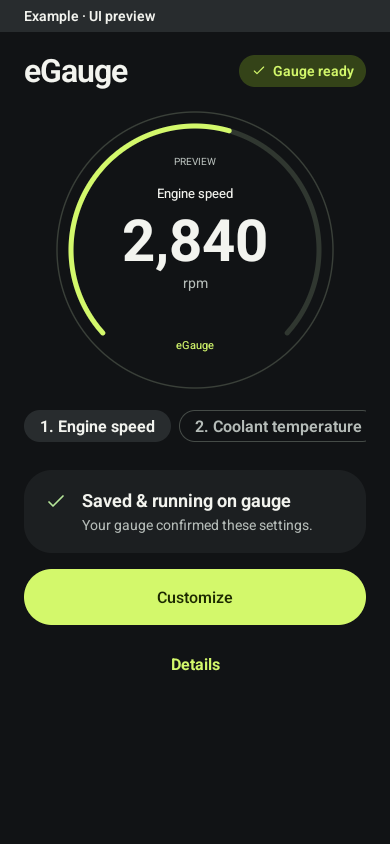
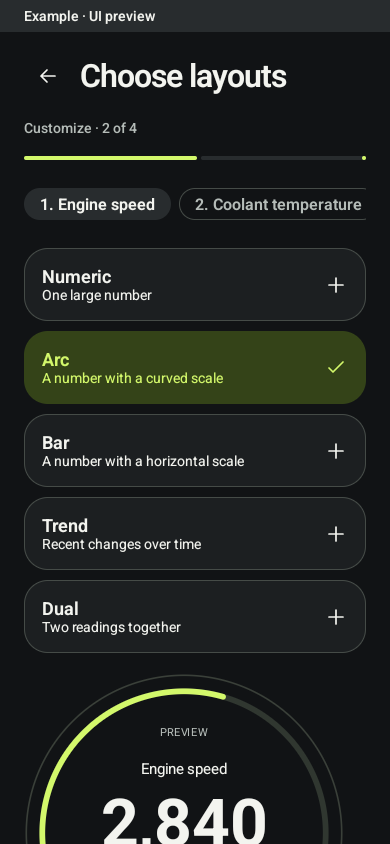

# eGauge

A standalone round OBD-II gauge and native Android companion for vehicle readings,
saved dashboard pages, display settings and signed development firmware updates.

The gauge runs independently after setup. The app configures it over owner-protected
BLE and transfers firmware over authenticated private Wi-Fi. Normal use needs no account.

## Current status

Working development hardware: Waveshare ESP32-S3-Touch-LCD-1.28 and Pixel companion.
Jeep testing recorded live engine RPM matching the dash, loss/recovery after adapter
removal, and a combined transmission Gear + Temperature page. Full transmission
fault lists are integrated and tested offline; their new App/gauge path still needs
physical qualification. Simultaneous adapters, additional drivetrain signals and
production releases remain open. See [current implementation and evidence](docs/current-state.md).

## App examples

These checked-in native UI fixtures use example readings. They are a recorded visual
baseline, not live vehicle data or a new hardware check. The round preview illustrates
a saved gauge layout; current behavior is described in the status summary.

<p>
  
  
</p>

## Start here

- **AI/project work:** [AGENTS.md](AGENTS.md), [context and code map](docs/ai-context.md).
- **Build and test:** [development setup](docs/development/setup.md), [quality gates](docs/development/quality.md).
- **Resume Jeep testing:** [saved TCM session](docs/development/tcm-session-resume.md).
- **Understand the system:** [architecture](docs/architecture/system.md), [Android](android/README.md), [firmware](firmware/gauge/README.md).
- **Wire behavior:** [BLE](docs/protocol/ble-v1.md), [adapter bindings](docs/protocol/adapter-bindings-v1.md), [diagnostics](docs/protocol/diagnostics-and-alerts.md), [updates](docs/protocol/firmware-update.md).
- **Product and remaining work:** [requirements](docs/requirements.md), [roadmap](docs/roadmap.md), [backlog and acceptance](docs/backlog.md), [design system](docs/design/design-system.md).
- **All documentation and historical evidence:** [documentation index](docs/README.md).

## Quick offline checks

```sh
python3 -m venv .venv
.venv/bin/pip install -r tools/requirements-test.txt
.venv/bin/python tools/validate.py
.venv/bin/python -m unittest discover -s tools/tests -p 'test_obd*.py'
```

Android uses JDK 17/SDK 36. Firmware uses ESP-IDF 5.4.1. Exact build and hardware
session instructions are in [setup](docs/development/setup.md). Offline tests use
fixtures and mocked adapters; they do not connect to a vehicle.

## Repository map

| Path | Responsibility |
| --- | --- |
| `firmware/gauge/` | ESP-IDF, LVGL display, adapter worker, owner BLE, configuration and signed update state |
| `android/` | Kotlin/Compose app, local profiles, exact configuration review and protected transport |
| `contracts/` | Versioned schemas and examples; runtime support is narrower than design contracts |
| `design/` | Shared visual tokens and explicitly simulated browser prototype |
| `docs/` | Current status, runtime maps, protocols, setup, evidence and remaining work |
| `tools/` | Validation, bounded vehicle capture, offline replay and research utilities |
| `data/vehicle-definitions/` | Research archive; not executable or qualified vehicle support |

[Vehicle research](docs/vehicles/README.md) and the [catalog scope/license record](docs/vehicles/catalog-research.md)
explain the imported reference data. Broad schema/catalog coverage does not imply
compatible hardware or permission to execute vehicle-changing commands.

## Contribution and licensing

Read [CONTRIBUTING.md](CONTRIBUTING.md). Commit tested changes and push the feature
branch after each session; review before merging into `main`. Firmware releases
are separate authorized actions after their required hardware checks.

Imported firmware retains its [MIT license](firmware/gauge/LICENSE); fonts retain
[SIL OFL](third_party/NotoSans-OFL.txt). See [third-party notices](THIRD_PARTY_NOTICES.md).
A project-wide license for new material has not been selected.
