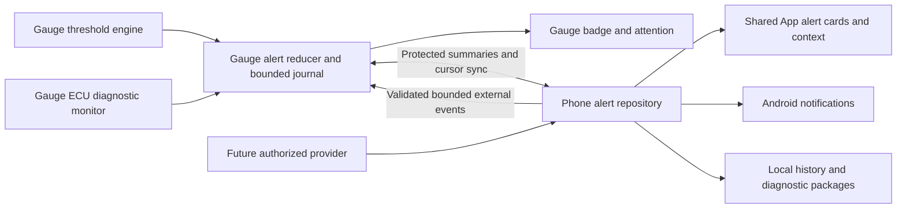

# Shared alerts, notifications and vehicle diagnostics

**ADR-015, accepted for development implementation.** Updated 2026-10-07. Decider: project owner; implementation
review follows repository gates. This is the maintained design and implementation
sequence for QUAL-05, FEATURE-03 and FEATURE-05. Dev.48 implements the software
slice below; physical qualification and live clearing/provider gates remain separate.
[Current state](../current-state.md) owns support; [backlog](../backlog.md) owns status.
[Wire contract](../protocol/diagnostics-and-alerts.md) owns implemented bytes.

## Context and goals

Use one logical vehicle, one alert framework and shared presentation for numeric/gear
thresholds, controller-reported MIL/faults, and future authorized external providers.
A normal vehicle uses one adapter. A swap's optional TCM adapter is a child of the
primary ECM connection and changes transport routing only. Neither page selection
nor adapter availability may remove readings, alert choices or the other source's data.
Multiple vehicles and gauges retain independent identities, assignments and history.

Keep the gauge autonomous, routine recovery automatic, consumer UI concise and raw
protocol information in Expert. Save context automatically so diagnosing an event
does not depend on the owner having the App open at that moment. Preserve existing
threshold dwell/hysteresis, shared connection widget, serialized operations and styling.
Android is active; iOS remains deferred. Vehicle control actions such as high idle
are outside this feature and cannot be invoked by an alert provider.

The [source audit](../evidence/alerts-diagnostics-design-audit.md) found adapter-bound
fault scope, page-dependent gauge fault visibility, hidden category availability,
and reproducible scheduler starvation. These must be corrected before adding UI polish.

## Decision and boundaries

Normalize producer transitions into one bounded event/lifecycle contract. The gauge
owns local threshold/diagnostic truth; the phone owns durable history, OS notification
presentation and external provider integration. A shared contract and parity vectors
keep policy consistent; existing producer algorithms are reused, not reimplemented.

A connection failure is availability, not a vehicle fault severity. Keep the universal
connection widget's transport truth; show the same shared vehicle alert summary beside
it where appropriate. Do not turn every retry into an alert or success toast.

## ECU identity and polling

Introduce a `DiagnosticEndpoint` independent of physical adapter index:
`vehicleId, endpointId, controllerRole, transportIndex, requestRoute, responseId,
profileDefinitionId/version, configRevision, connectionSession`. Initially bound to
at most two reviewed endpoints, Engine and Transmission; no arbitrary module scan.
7E8/7E9 and 7E0/7E1 are this captured CAN profile's addresses, not universal identities.
Enable an endpoint from supported profile/observed evidence, not its address alone.

Each endpoint has separate MIL, stored, pending, permanent and readiness observations,
query results, timestamps, retry state and truncation/coverage flags. An unavailable
TCM endpoint behind a healthy primary adapter must not disconnect ECM or invalidate
its readings. Physical adapter loss invalidates only endpoints routed through it.
Reconnect increments that transport's session; reject late replies from retired sessions.
The worker associates the decoded reply with its endpoint/request, instead of assigning
Mode 01 PID 01 from an untagged callback to whichever adapter is currently active.

Replace background admission based on ten normal PID reads with monotonic deadlines
and fair endpoint/category selection. Starting tuning targets: MIL every 15 seconds,
stored/pending every 60 seconds, permanent every 120 seconds. These are targets, not
promised vehicle latency. Give changed MIL one coalesced fault-refresh request; do not
restart a scan for each poll. Keep foreground readings first, admit one due diagnostic
job at a time, cap each request and back off failures per endpoint/category with jitter.
Measure late-job age and PID latency; no catch-up burst or permanent-code starvation.
Discovery, configuration, OTA and explicit clear operations retain coordinator priority.

## MIL, code and coverage semantics

Keep lamp state independent of code presence. Mode 01 PID 01 contains a commanded
MIL bit, count and readiness; it cannot establish a flashing lamp. A stored, pending
or permanent code alone cannot establish that the lamp is on or the vehicle is critical.
See the [reference decoder](https://github.com/brendan-w/python-OBD/blob/master/obd/decoders.py).

Show Engine check-engine status from the qualified engine endpoint. A TCM's reported
malfunction status is labelled as Transmission until its relationship to the physical
lamp is qualified. The common vehicle summary includes both without claiming a
TCM response is proof of the dashboard CEL. Required endpoints come from the profile:
any fresh reported On makes the aggregate malfunction state On, with partial coverage
if another required endpoint is unknown. Off requires fresh Off for every required
MIL-capable endpoint. Otherwise show Unknown or Last checked. Known unsupported
queries are explicit coverage limitations, never fresh Off.

Deduplicate by endpoint, category and code; retain overlapping categories and ECU
origins. A code disappearing from a fresh complete category can resolve that occurrence;
an unavailable/truncated list cannot prove it disappeared. MIL Off does not discard
codes. Do not substitute stored-list length for the ECU's reported MIL count.
Readiness is Supported complete, Supported incomplete, Unsupported or Unknown per
monitor. Optional Mode 02 freeze frames require their own bounded retrieval/decoder;
a locally recorded sensor timeline must never be labelled an ECU freeze frame.
[OBD Solutions diagnostic guidance](https://support.obdsol.com/support/solutions/articles/43000711154-get-started-with-diagnostics)
describes diagnostic context and the loss of freeze-frame data when clearing.
Manufacturer descriptions require licensed, versioned provenance; unknown meanings
remain explicit. ABS/SRS/body faults require separate documented module profiles.

## Shared model and lifecycle

| Record | Required information |
| --- | --- |
| Alert episode | Stable ID; vehicle/gauge ID; producer and correlation key; rule/controller/code/provider identity; configuration/profile versions; initial and current severity; lifecycle; first/last observation; boot/session; context/capture references |
| Transition | Episode ID; unique producer boot ID and sequence; kind; previous/new state; monotonic time; optional phone UTC mapping and clock uncertainty; reason and availability |
| Presentation state | Acknowledged severity/time; snooze expiry; notification delivery state; user policy version; separate from producer truth |
| Context | Trigger and applicable threshold/unit; actual observations with age/validity; endpoint coverage; MIL/categories/readiness; versions and capture gaps |
| Action descriptor | Reviewed action ID, label, eligibility and typed scoped arguments; no arbitrary command, URI or provider script |

Lifecycle is Active, Resolved or Expired. Availability is independently Fresh,
Unavailable, Stale or Unsupported. Acknowledgment and snooze are independent attention
states. Missing telemetry preserves an active threshold's severity with an unavailable
qualifier; it never resolves it. Fresh recovery restarts existing dwell requirements.
TTL expiry ends an external episode as Expired, not a confirmed resolved vehicle fault.
Reboot/history gaps are explicit; do not fabricate exact onset or resolution times.

Threshold transitions reuse `alert_engine.c`: entry, escalation/de-escalation, resolution
and availability changes. Diagnostics produce MIL changes and DTC occurrence/category
changes; one MIL episode may reference several codes without repeating the same warning
for every category. Correlation cannot erase separate controller provenance. External
providers use reviewed adapters and the same reducer. Immutable entry evidence stays
available even when presentation policy or display units change.

## Severity, attention and actions

| Severity | Starting policy | Gauge/App treatment | Allowed context/actions |
| --- | --- | --- | --- |
| Information | Historical/permanent code with MIL Off; routine recorded event | History/card; no interrupt by default | View codes/context, save report |
| Advisory | New pending/code occurrence without fresh MIL On; qualified external notice | Small badge/card; optional quiet notification | Context, acknowledge, bounded snooze |
| Warning | Fresh steady MIL On or configured warning threshold | Amber labelled badge/banner; one entry cue | Context/trend/codes, acknowledge, snooze |
| Critical | Configured critical threshold or independently reviewed critical condition | Highest-priority readable red attention overlay | Context and acknowledge; persistent active badge |

These are conservative defaults, not a diagnosis from a code number. Reviewed profiles
can supply specific recommendations with provenance. Never escalate an unknown code to
Critical automatically. Provider-supplied severity is capped by trusted local policy.
Color accompanies text/icon; use shared design tokens and reduced-motion steady cues.
No rapid flashing, sound/haptics on the gauge or new tap/long-press gestures are assumed.
Preserve current pairing/page gestures. Start with a global badge visible on every page;
qualify any new overlay interaction separately for touch and accessibility.

Only one gauge/App attention overlay at once. Order by severity, trusted priority,
then activation age; allow access to other active alerts. Entry and severity escalation
can interrupt once. Repeated samples cannot retrigger. Acknowledge suppresses attention
at that severity, not measurement, logging, active status or escalation. Default warning
snooze is five minutes; never implicitly suppress a new higher severity. Critical
acknowledgment returns to the dashboard with a persistent badge. OS dismissal does not
silently acknowledge a gauge episode. Phone acknowledgment is scoped to its episode
and reconciled after disconnect; never apply it to a newly activated episode.

Shared App `AlertCard`, `AlertSummary`, context sheet and timeline render all producers.
Car shows one vehicle status and full categorized codes, including Not checked,
Unsupported, Unavailable and Last checked states when lists are empty. Relevant origin
labels are Engine/Transmission; addresses/raw requests remain Expert. The context sheet
shows what happened, current/last checked status, trend/codes, captured context and next
reviewed actions. Useful defaults: View context, View codes/trend, Save report,
Acknowledge and Snooze. Clear codes is a separate explicit scoped operation.

## Android notification delivery

Default to visible in-App presentation while eGauge is foreground. Avoid duplicate
heads-up notifications for the same episode already on screen. Outside the App, notify
once on fresh activation or escalation and update the existing episode notification.
Reconnect/history import is silent; an old critical event does not become a new live
emergency. Group by vehicle and use a few durable channels: Critical alerts, Vehicle
warnings and Optional notices. Start with sound only for enabled critical notifications,
warning notifications quiet, optional notices off. System channel/user settings govern
actual delivery. Do not bypass Do Not Disturb or force full-screen intents.

Ask for Android notification permission when the owner enables phone notifications;
denial preserves gauge and in-App behavior without repeated prompts. Use private lock
screen content by default. Deep links carry scoped vehicle/episode IDs, validate the
current association and open its context, not an unrelated current vehicle. Historic
context is read-only. No clearing or vehicle writes from a notification action.
[Android permission guidance](https://developer.android.com/develop/ui/compose/notifications/notification-permission)
explains the runtime permission and user control.

Without enabled monitoring, phone polling is foreground-only. Dev.48 implements an
opt-in connected-device foreground service through the existing single BLE owner,
started from the visible App. Its locked/background/OEM behavior still needs physical
qualification; receiving historical events later is not continuous monitoring. Evaluate companion
presence APIs before adding another lifecycle owner. Test process termination, user stop,
lock screen and battery restrictions. Report monitoring unavailable concisely; never
promise delivery while disconnected. Gauge-local warnings remain autonomous.
[Android BLE lifecycle guidance](https://developer.android.com/develop/connectivity/bluetooth/ble/background)
describes supported service/presence approaches and background launch restrictions.

## Automatic diagnostic collection and storage

Collect transitions, not an event per sample. On meaningful entry/escalation, capture
trigger settings, canonical value/unit, freshness, current diagnostic categories/MIL,
readiness if available, existing RPM/speed/coolant/voltage/TCM values, configuration,
profile/calibration and App/firmware versions. Capture only already polled readings;
additional freeze-frame/readiness reads are low-priority bounded jobs. Missing context
is marked partial with cause. Do not block a critical alert while collecting it.

Starting memory budgets to measure, not qualified capacities: gauge event ring 64
entries of at most 128 bytes; transition queue 16 entries; context sampling of up to
16 selected readings at at most 1 Hz, 10 seconds before and 20 seconds after. Record
actual sample time/age, not artificial fresh copies. Reserve at most 32 KiB PSRAM for
context and two concurrent captures; merge overlapping windows or drop lower priority
capture work with an explicit gap marker. Preserve alert truth if recording fails.
Bound internal-memory queues and prove allocation failure behavior on the actual board.

Use batched append-only gauge event persistence in a dedicated bounded journal after
partition/wear review. No per-sample NVS writes, dynamic growth or flash work in BLE/UI
callbacks. If storage is unavailable, retain RAM events and advertise loss boundaries;
RAM-only history cannot promise survival across power loss. Recover committed records,
ignore interrupted tails, expose oldest/newest sequence and dropped-event count.
Bulk sensor windows may be lost while disconnected; sync compact event context first.

Phone: use the separate SQLite `AlertRepository` for episodes, transitions,
cursor checkpoints and bounded inline capture JSON.
Current LocalSetupStore remains the authoritative setup store; SQLite
is the separate implemented event-storage addition. Database transactions store a received batch and
cursor together before acknowledging progress. Unique transition IDs make retries
idempotent. Capture JSON and metadata are updated transactionally; mark incomplete
windows explicitly rather than synthesizing missing samples. All storage runs
off the UI thread through one owner. The implementation uses the platform SQLiteOpenHelper without adding a database dependency.
Schema 1 migration failures preserve the database rather than silently rebuilding history.

Defaults: unpinned history retained for 30 days, at most 500 episodes and 50 MiB total,
whichever limit is reached first. Keep active episodes and their compact context;
evict resolved unpinned bulk captures first. Pinned reports remain within the total
budget and cannot grow without bound. If active/pinned data fills the budget, degrade
bulk recording and show one actionable storage status. Never lose alert presentation
because a write failed. Include deletion, storage usage and user-initiated ZIP export
with JSON manifest, timelines and readable report; exports explicitly identify partial,
simulated, uncertain or stale data. History deletion does not clear ECU codes.

No cloud dependency, background upload, VIN or precise location collection by default.
Exclude diagnostics from automatic platform backup initially; exporting is explicit.
Future location-based providers require a reviewed consent/retention policy. Redact
raw adapter identifiers from shared reports by default; keep necessary endpoint/profile
provenance. Bind history to stable vehicle IDs across renaming; vehicle deletion asks
once whether to retain anonymized history or delete it. No reassignment to another car.

## Clearing codes and preserving evidence

First release clearing is App-initiated for explicitly qualified emissions endpoints.
Mode 04 clears a protocol-defined scope, not one chosen DTC. Determine whether an
addressed request is actually supported; a functional broadcast may affect multiple
controllers and must be described as that scope. Unqualified JSS clear behavior stays
disabled even when fault reading works. Permanent codes cannot be erased by a scan
tool and can remain with MIL Off, as documented by [BAR](https://www.bar.ca.gov/obd-test-reference).

1. Read fresh target diagnostic state and save a durable pre-clear report. Include
   available readiness/freeze frames and explicit gaps. Storage failure gets one
   deliberate choice to free space or continue without a saved report, never silent loss.
2. Preview the actual controller/network scope and diagnostic/readiness consequences.
   Require parked, ignition ON, engine OFF confirmation, supported by fresh RPM/speed
   when available. Unknown values do not establish stopped state. No secret gesture;
   use one dedicated confirmation with an accessible alternative to hold-to-confirm.
3. Prepare a one-use 30-second token bound to owner, operation ID, vehicle/gauge,
   configuration, endpoint route and connection session. Firmware independently checks
   eligibility and acquires the existing exclusive operation lease. Reject during
   discovery/update/config commit; serialize against polling on that transport.
4. Journal the admitted operation before its side effect. Issue the clear at most once,
   restore routing and release resources on all exits. Duplicate confirmation returns
   recorded state; token/session changes cannot replay a write. An interrupted journal
   is Uncertain on boot, not assumed success and not permission to retry automatically.
5. Read MIL, supported categories and readiness after a bounded profile-specific settle.
   Report Acknowledged and verified, Codes remain, Permanent codes remain,
   Verification incomplete, or Failed. Post-send timeout/disconnect is Outcome unknown:
   reconnect and reconcile reads only. Another clear requires a new explicit action.

Acknowledgment/notification dismissal never issues Mode 04. Successful command reply
never itself resolves alert episodes; only fresh producer observations do that. Preserve
pre/post snapshots and link the clear operation to affected episodes. Do not promise a
repair, inspection readiness or a restored freeze frame. Defer on-gauge clearing until
its authorization, gesture and accessible confirmation path is separately designed.

## Protocol and compatibility plan

Keep implemented protected 39/3A v15 and legacy 30/v5 semantics unchanged. New endpoint
selection must not reinterpret physical source indices for old clients. Add negotiated,
versioned protected diagnostic/alert extensions after auditing opcode/layout capacity.
The implemented development additions are allocated in the wire contract. Future
extensions must version new semantics and retain legacy layouts; reserved bytes are
not permission to change existing client behavior.

New contracts need bounded endpoint observations, active episode summaries, transition
cursor batches, capture fragments, acknowledgment/snooze and clear prepare/confirm/status.
Include vehicle/gauge/config/session/endpoint identity, producer boot ID, sequence,
length/version and completeness. A notification may hint that state changed, followed
by a protected read; no raw faults/history on public unauthenticated characteristics.
Firmware summarizes per endpoint; App aggregates per vehicle. Old clients retain their
existing read coverage and never display an unimplemented clear action.

Dev.48 cursor reads return explicit gap/reboot markers and at most four transitions
per 360-byte batch;
receiver persists before cursor progress. Active snapshot resynchronizes after a gap.
Do not resolve an episode merely because its event was evicted. State and acknowledgment
conflicts follow producer session/episode identity, not last wall-clock timestamp.
Unsupported extension is a capability limitation; auth/malformed/transport failure is
not fallback eligibility. Add C/Kotlin parity vectors before enabling either side.
Keep public config/OTA flags and qualified link count unchanged until their separate gates.

## Future external-provider seam

Ship a synthetic provider fixture first, using the same normalized event/action model.
A live provider needs documented authorized access, licensing, attribution, TTL and
coverage. Do not assume an existing app exports alerts or use notification/map scraping
as a production feed. Validate producer ID, lengths, bounded text, replay/sequence,
expiry, location relevance where applicable and severity caps. No arbitrary markup,
links, transport commands or external actions. External failures cannot stall local
thresholds/MIL. Live feeds remain a separate entry gate, not a prerequisite for this framework.

## Framework extension checklist

This is the standing procedure for adding or changing an alert producer. Keep one
framework even when a new source initially runs only on the phone or one board.

1. Define the producer's authoritative observation and coverage. Preserve vehicle,
   gauge, endpoint/provider, boot/session and configuration identities. Specify units,
   correlation, expiry and severity limits; missing data cannot resolve an episode.
2. Reuse the existing evaluator or reviewed decoder. Thresholds emit through
   `alert_engine.c`; diagnostics through endpoint snapshots; paired-phone sources
   through `ExternalAlerts.kt`. Normalize transitions in `alert_events.c` and the
   Kotlin codec rather than adding a parallel lifecycle or rule engine.
3. Keep callbacks nonblocking and admission, sample/window storage and retries bounded.
   Use `alert_runtime.c` for gauge queue/journal/capture and the existing App operation
   lease for transport. Recording failure must not suppress live alert presentation.
4. Reuse `AlertRepository`, `AlertNotifications`, `AlertMonitoringService` and
   `ui/AlertPresentation.kt`. Preserve immutable initial context, atomic cursor import,
   scoped reports and silent history/reconnect. Source-specific context uses reviewed
   typed fields; it does not create another notification owner or command path.
5. Version any wire/storage change in its maintained contract. Check compatibility,
   scope changes, replay, stale/unsupported data, eviction, queue/storage failure and
   interruption. Add production C/Kotlin parity vectors when bytes change. Test the
   real threshold sink or producer boundary instead of only a duplicate test model.
6. Update this ADR for responsibility/policy changes and the wire contract for bytes.
   Update the AI source map when ownership moves. Current state owns supported behavior;
   backlog owns readiness and hardware gates; evidence owns dated tests and measurements.
   Replace superseded instructions in the same commit rather than appending alternatives.
7. Qualify attention, context, storage and recovery on affected devices before promoting
   capability claims. External feeds require the provider guide's authorization,
   licensing, relevance and privacy gates. ECU writes retain separate explicit action
   and at-most-once outcome rules; an alert must never invoke an arbitrary vehicle write.

Review every extension against autonomous gauge operation, healthy sibling continuity,
notification deduplication and truthful Last checked/Unavailable presentation. Do not
increase event keys, storage or radio budgets without measuring their effect.

## Alternatives and tradeoffs

| Option | Benefit | Cost / decision |
| --- | --- | --- |
| Separate CEL, threshold and external notifications | Fast isolated prototypes | Duplicate lifecycle/history/actions, inconsistent severity and stale behavior; reject |
| One common reducer and producer adapters | Shared UX, deduplication, capture and tests | Versioned identities and lifecycle need explicit design; selected |
| Phone evaluates all alerts | Simpler gauge | Loses autonomous warnings and history when disconnected; reject |
| Store history in setup JSON/preferences | No new storage library | Rewrites growing collections, poor transactional cursors/queries; keep preferences for setup only |
| Continuous full-rate telemetry recording | More raw evidence | Radio/flash/battery cost and unbounded storage; selected bounded event windows |

Main risk is overbuilding before correcting fault scope. Deliver the phases below in
order, keep one cohesive workspace, and reuse current module owners. Measure budgets
before expanding them. Critical thresholds remain actionable when optional history,
phone monitoring or provider services fail.

## Implementation sequence and file ownership

The phase table records delivery responsibilities. Dev.48 source ownership is in
the [AI source map](../ai-context.md#source-map); remaining qualification is in the backlog.

| Phase | Scope and likely files | Completion evidence |
| --- | --- | --- |
| 1. Fault correctness, QUAL-05 | `poll_scheduler.c`, `main.c`, `ble_obd.c`, `diagnostics_state.c`; `VehicleDiagnostics.kt`, `DiagnosticPresentation.kt`, `CarScreen.kt` | Starvation regression; independent endpoint replies/coverage; whole-vehicle MIL/code rendering; no current-page filtering |
| 2. Shared event contract, FEATURE-05 | New C `alert_events` reducer/journal interface; existing `alert_engine.c`, `ui.c`; new Kotlin alert models/reducer; contracts and parity fixtures | Threshold/MIL adapters, consistent identities/severity/lifecycle, hidden-page attention, cancellation and no duplicate transitions |
| 3. Context/history sync, FEATURE-05 | New bounded capture/journal worker; `ble_companion.c`; `GaugeConfigTransferClient.kt`; new `AlertRepository` and migrations/export owner | Budget/queue/flash tests, cursor gaps/idempotence, durable-before-progress, pre/post windows, partial captures, eviction and reports |
| 4. Shared UI/notifications, FEATURE-05 | Shared Compose alert components/state mapper; new Android notification presenter; manifest and existing lifecycle coordinator | Foreground/background policy, permission/channel behavior, scoped context actions, no repeat sound on polling or history import |
| 5. Clear operations, FEATURE-03 | New bounded firmware clear coordinator; `ble_obd.c`; protected codecs; Android operation journal/context sheet | Explicit scope, pre-clear report, prepare/confirm/status parity, uncertain-write reconciliation and one-send fault-injection proof |
| 6. Qualification, QUAL-11 | Focused C/Kotlin/replay tests and maintained quality matrix | Hardware observations for global alerts, long reads, clear outcomes, background/restart/recovery/resource limits |
| 7. Provider adapter, FEATURE-06 | Synthetic adapter through existing framework, then one authorized live integration | TTL/replay/severity/action limits and no interference; live source/rights gate separately satisfied |

Stages 1 through 5 can progress with offline fixtures/emulators. Phase 4 background
monitoring needs Android qualification; Phase 5 live clearing needs the owner's chosen
parked session and qualified controller semantics. A single Vgate can test ECM then
TCM sequentially. It cannot prove simultaneous dual-adapter behavior.

## Focused acceptance matrix

| Area | Offline/automated cases | Physical qualification |
| --- | --- | --- |
| Endpoint routing | ECM/TCM on one transport and child; mismatched responder/session; one endpoint never replies; no pages and slow PIDs; uint32 clock wrap | Sequential engine/TCM captured scope first; second adapter only when available |
| Fault truth | MIL Off plus codes; MIL On zero codes; unsupported vs unavailable; empty fresh vs stale/truncated; duplicate categories; legacy coverage | Lamp comparison plus attributed full lists/category availability, unplug/reconnect and hidden-page visibility |
| Lifecycle/attention | Entry/dwell/hysteresis, severity change, ack/snooze, stale recovery, simultaneous producers, event eviction, reboot gap | Gauge phone-off behavior, overlays/touch/reduced motion and persistent badges |
| Capture/storage | Full queue/disk, PSRAM failure, interrupted journal/file/DB writes, overlapping windows, cursor duplicate/gap, retention/export/delete | Sustained polling/heap/flash latency and power-cycle evidence; no display/adapter deadlock |
| Notifications | Denied permission, disabled channels, foreground dedup, grouped vehicles, stale deep link, replay without sound | Locked Pixel, background/process restart, user-stopped service, OEM/battery limits |
| Clearing | Emulated addressed vs broadcast scope, token expiry/duplicate, precondition/session change, disconnect before/after send, process/power loss, permanent codes remain | Only explicit parked clear with report saved, exact ECU/network scope and complete before/after readback; never induce faults or auto-clear during tests |
| External provider | Expiry, stale/replayed/malformed payload, priority spoof, prohibited action, unavailable feed | Synthetic protected phone-to-gauge slice; live provider qualification separately |

## Development implementation and next qualification

Dev.48 implements endpoint state/routing, fair diagnostics, the existing threshold
engine's shared sink, bounded events and NVS transitions, two volatile context
windows, transactional SQLite history, export, shared UI and opt-in Android monitoring.
An application-scoped owner keeps Activity/service on the existing operation lease.
Phone history loads without a current gauge connection; stale history is last checked.
The [phone-provider guide](phone-alert-providers.md) defines the implemented synthetic
seam and required live integration work. At-most-once Engine clearing is implemented
behind a default-off build gate; TCM clearing is not qualified.

Implementation limits: 44 keys, 64 RAM transitions, 32 persisted transitions, two
windows of at most sixteen readings/480 samples, 1 Hz ten-second prebuffer/twenty-second
postbuffer. Windows are volatile until phone import. SQLite retains 30-day/500 inactive
unpinned episodes, 100 pinned reports, 100 clear reports, 10000 transitions, 100 recent
configuration mappings and a 50 MiB logical payload budget. Under pressure context
may degrade; active metadata and pinned reports are retained. Record budget/wear/heap
qualification independently of these source bounds. Raw readiness is preserved;
freeze-frame capture and live providers remain future work. Synthetic and unavailable
history cannot produce a fresh vehicle notification.

Continue QUAL-05/QUAL-11 with parked endpoint reads, gauge attention/touch, background
Pixel notification behavior, power/storage loss and measured polling/flash budgets.
Never enable live clearing from offline success alone. Validate configured alert response expectations against measured
poll cadence and dwell; do not promise a short trigger time the adapter cannot sustain. Record task IDs and measured/source/physical evidence separately
in the PR. Follow existing commit, release and hardware gates; this document does not
publish firmware, enable a capability or authorize an unattended vehicle command.
