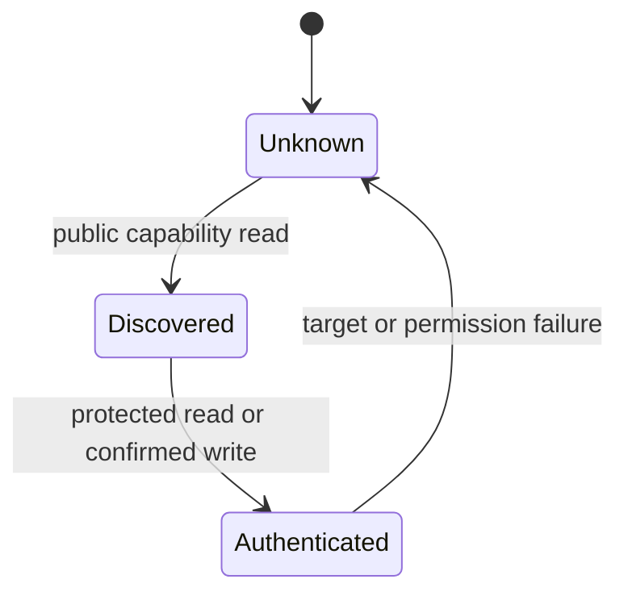
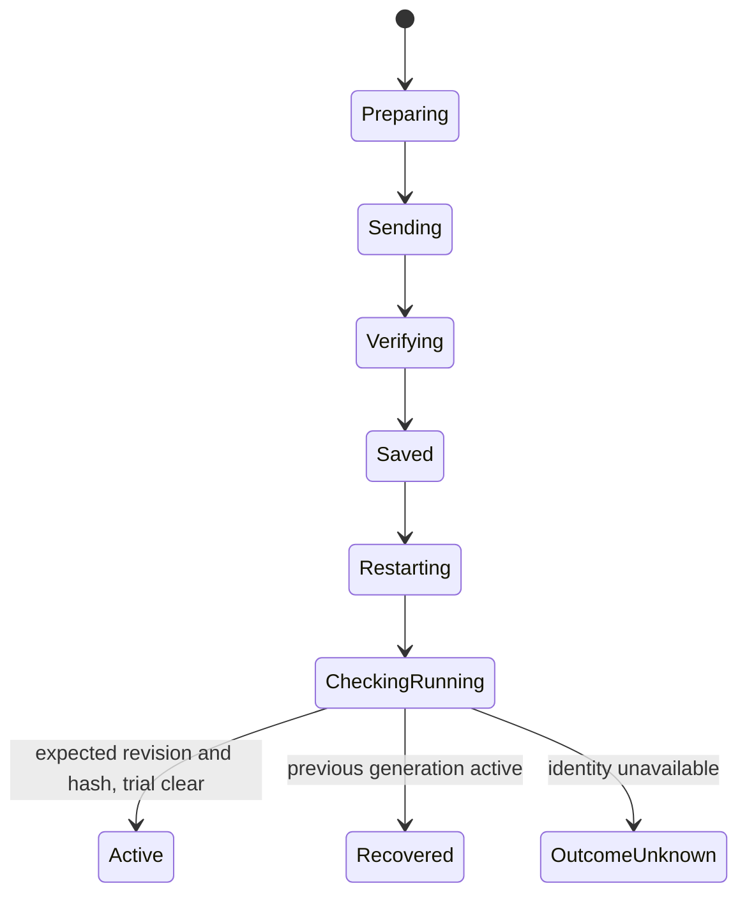

# Android companion runtime

Date: 2026-09-26. This describes the implemented companion architecture on `feat/owned-gauge-control`.

## Responsibilities and boundaries

The companion has four primary destinations: Gauge, Readings, Vehicle, and Settings. Gauge edits a local per-vehicle draft and reviews the exact numeric pages and coolant alert that the implemented firmware subset can execute. Readings separates examples from observations. Vehicle owns profiles and the optional second-adapter preference. Settings owns association, protected maintenance reads, rotation, diagnostics, and development updates.

`AppViewModel` owns operation lifetime. `MainActivity` owns Android permission prompts, the system file picker, and window flags. Composables only dispatch intent and render state. `OperationCoordinator` grants one process-local BLE operation lease, so discovery, protected reads, configuration, and firmware upload cannot overlap. Every terminal operation reports Active, Recovered, Failed, or Outcome unknown instead of relying on one generic progress string.

Public discovery and owner access are separate states:

Discovery gathers all matching advertisers for a short bounded window. A single result is selected automatically. Multiple results require a user choice. The chosen BLE identity is remembered locally. RSSI orders the list but never proves identity. Android owns the bond secret; the app stores no passkey or bond key.

## Configuration transaction

`ConfigurationProjector` is the single projection from the local draft to the supported firmware document. It blocks unsupported renderers and TCM source transfer. The review and wire payload use the same projection. The transaction captures the profile, draft, base revision, and base hash before sending.

Stored revision and hash alone do not establish success. `GaugeConfigTransferClient` waits for runtime identity, rejects mismatches, keeps a trial in Waiting, and exposes firmware recovery. Cancellation closes the GATT connection and does not convert cancellation into a retry failure.

## Evidence lifetime

Device-specific caches are cleared when discovery fails or a different target is selected. Owner state becomes authenticated only after a protected operation succeeds. Diagnostic freshness is derived from a monotonic receipt timestamp and expires after 30 seconds. Vehicle PID examples never become vehicle observations. An observation model carries profile, session, adapter, ECU, source, PID, and observation time.

## Storage and recovery

Profile documents have an explicit schema version. Version 1 profiles migrate to version 2. A legacy TCM draft enables the advanced second-adapter preference without changing its source. Unknown newer schemas and unsupported enum values fail closed and preserve the stored source document. Saves use synchronous commit and report failure.

The selected gauge identity and the minimal firmware-update recovery journal use separate private preference files. An interrupted update records target identity, image digest, stage, and time. On relaunch, the app asks for a protected running-firmware read before retry. A successful identity read reconciles and clears the journal. BLE upload remains an explicitly foreground workflow; the debug build keeps the phone awake while visible.

## Protocol and transport rules

Pure codecs validate capability JSON, diagnostics, and runtime identity before UI state changes. Invalid versions, lengths, reserved bits, and ranges are errors. Transfer callbacks enter a bounded channel. The process-level operation coordinator serializes sessions, and each client connection owns its callback queue and deadline. A callback cannot complete another connection's deferred result.

Production support still requires a shared reusable GATT request layer if the protocol surface grows. The current bounded and serialized behavior is the compatibility-preserving foundation. Wi-Fi transport may later implement the same operation contract, but the current app does not offer Wi-Fi configuration or update controls.

## Feature evidence boundaries

- Numeric ECM configuration, protected status, display rotation, and the development update protocol have prior phone and gauge evidence.
- The GitHub catalog path is development trust only until a published release is exercised from a fresh app install.
- Live OBD PID traffic, DTC clearing, dual-adapter concurrency, and stable production OTA remain unavailable or unqualified.
- Enabling the second-adapter preference changes a local profile only. It does not claim simultaneous firmware support.

