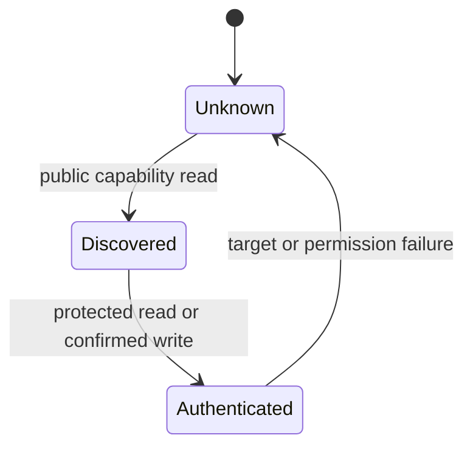
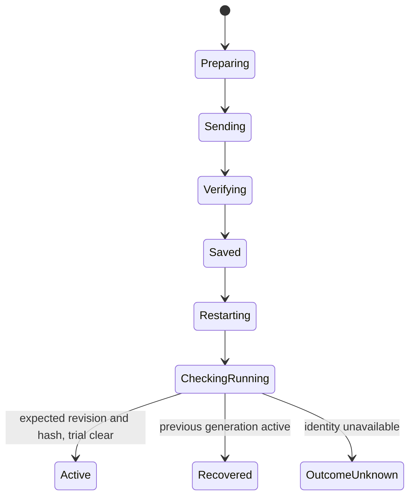

# Android companion runtime

Updated 2026-10-06. This describes current ownership; evidence limits are in [current state](../current-state.md).

## Responsibilities and boundaries

Gauge, Car and Settings are primary destinations; Settings reveals optional Expert.
Customize uses focused reading/layout sheets and exact review/send. Setup handles
association. Settings owns brightness, orientation, units, page cycling and updates.
Car owns source-specific fault views and adapter/profile selection. Technical reports,
definition examples and maintenance details remain in Expert. Preview readings never
become live vehicle observations.

`AppViewModel` owns operation lifetime. `MainActivity` owns Android permission prompts, the system file picker, and window flags. Composables only dispatch intent and render state. `OperationCoordinator` grants one process-local BLE operation lease, so discovery, protected reads, configuration, and firmware upload cannot overlap. Every terminal operation reports Active, Recovered, Failed, or Outcome unknown instead of relying on one generic progress string.

Public discovery and owner access are separate states:

Discovery gathers all matching advertisers for a short bounded window. A single result is selected automatically. Multiple results require a user choice. Multiple identities and per-gauge desired vehicle/source assignments are remembered locally; the phone selects one connection at a time. Settings owns the saved-gauge picker. RSSI orders the list but never proves identity. Android owns the bond secret; the app stores no passkey or bond key.

## Configuration transaction

`ConfigurationProjector.projectVehicle` sends one whole vehicle dashboard through
its primary adapter. Explicit Expert child mode changes transmission-definition
routing to a second adapter; it never filters pages. New execution requires `va:1`,
and two transports also require `da:1`. The editor, review and wire payload retain
the same page order and actions. Per-source reads, retry schedules and confirmed
revision scope stay separate. Source selection edits only an Expert binding.
The transaction captures profile, dashboard, base revision and base hash before sending.

Stored revision and hash alone do not establish success. `GaugeConfigTransferClient` waits for runtime identity, rejects mismatches, keeps a trial in Waiting, and exposes firmware recovery. Cancellation closes the GATT connection and does not convert cancellation into a retry failure.

## Evidence lifetime

Device-specific caches are cleared when discovery fails or a different target is selected. Owner state becomes authenticated only after a protected operation succeeds. Diagnostic freshness is derived from a monotonic receipt timestamp and expires after 30 seconds. Vehicle PID examples never become vehicle observations. An observation model carries profile, session, adapter, ECU, source, PID, and observation time.

## Storage and recovery

Profile schema 6 adds an optional nested transmission child while retaining schemas 1 through 5. Gauge association schema 1 retains multiple identities and desired contexts. Legacy standalone TCM profiles remain unchanged until explicitly attached. See [vehicle connections](vehicle-connections.md) for invariants and migration. Unknown newer schemas and unsupported enum values fail closed and preserve the stored source document. Saves use synchronous commit and report failure.

The selected gauge identity and the minimal firmware-update recovery journal use separate private preference files. An interrupted update records target identity, image digest, stage, and time. On relaunch, the app asks for a protected running-firmware read before retry. A successful identity read reconciles and clears the journal. BLE upload remains an explicitly foreground workflow; the debug build keeps the phone awake while visible.

## Protocol and transport rules

Pure codecs validate capability JSON, diagnostics, and runtime identity before UI state changes. Invalid versions, lengths, reserved bits, and ranges are errors. Transfer callbacks enter a bounded channel. The process-level operation coordinator serializes sessions, and each client connection owns its callback queue and deadline. A callback cannot complete another connection's deferred result.

Production support still requires a shared reusable GATT request layer if the protocol surface grows. The current bounded and serialized behavior is the compatibility-preserving foundation. `WifiBulkClient` implements the authenticated private Wi-Fi update path using the
same protected maintenance state. Configuration remains on the bounded BLE path.

## Feature evidence boundaries

- Numeric ECM configuration, protected status, display rotation, and the development update protocol have prior phone and gauge evidence.
- The GitHub catalog path is development trust only until a published release is exercised from a fresh app install.
- Live Engine RPM and combined Transmission Gear + Temperature have recorded owner observations.
- Full source-scoped fault snapshots are implemented and offline-tested; new physical checks are pending.
- DTC clearing, dual-adapter concurrency and production OTA remain unavailable or unqualified.
- Enabling the second-adapter preference changes a local profile only. It does not claim simultaneous firmware support.

## Regional units

On first use, `preferredMeasurementSystem` uses the Android app locale region and
Unicode temperature preferences. US, Bahamas, Belize, Cayman Islands, Puerto Rico
and Palau default to Fahrenheit; other regions default to Celsius. A saved choice
wins. Confirmed gauge settings remain authoritative and do not get overwritten by
regional defaults. No language-only inference or automatic gauge write is made.
The existing Metric/Imperial preference also controls speed presentation; canonical
configuration and alert values stay metric. Region mapping follows
[Unicode CLDR measurementData](https://raw.githubusercontent.com/unicode-org/cldr/main/common/supplemental/supplementalData.xml).

## Confirmation after gauge restart

A protected reconnect attempt's own timeout is retryable read unavailability, not
cancellation of the user's transaction. `restartRead` distinguishes session timeout
from actual caller cancellation and closes each attempt before the next. Configuration
confirmation shares a bounded saved/running read budget; firmware uses its existing
exact-image and trial decision deadline. Never resend an uncertain write to obtain
confirmation. Evidence: [restart/editor rollout](../development/restart-and-dashboard-rollout.md).
