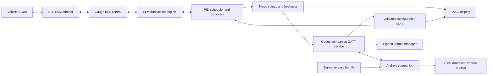

# System architecture, draft 0.1

The gauge owns the adapter connection. Android is a central for the gauge's peripheral service. This allows normal operation without the app and avoids competing phone/gauge connections to adapters that accept a single client. ESP-NimBLE multi-role capability supports the design, but two adapter links plus the phone must pass a board-specific spike before feature implementation. [Espressif multi-connection guide](https://docs.espressif.com/projects/esp-idf/en/v5.5.3/esp32s3/api-guides/ble/ble-multiconnection-guide.html) is evidence of stack capability, not validation of our IDF 5.4.1 binary.

## Firmware boundaries

| Module | Owns | Must not own |
| --- | --- | --- |
| board | LCD/touch/backlight/rotation, board ID, power observations | PID interpretation |
| adapter_link | Selected peer identity, GATT profile, reconnect state | Dashboard or phone lifecycle |
| elm_transport | Fragment assembly through `>` prompt, one outstanding request, command timeout and resync | UI rendering |
| vehicle_protocol | Headers/ECU identity, multi-response parsing, supported queries, Mode 01/22 response matching | Arbitrary user scripts |
| pid_engine | Definitions, bounded decoders, units, sample status | BLE callbacks |
| diagnostics | MIL/readiness/DTC snapshots, explicit clear transaction | Generic custom requests |
| alert_engine | Freshness-aware local threshold state, priorities and acknowledgments | Phone availability |
| scheduler | Priorities, measured transaction budget, background discovery | Direct LVGL calls |
| telemetry_store | Immutable snapshots with age, quality, source, sequence | Persistent write per reading |
| ui | LVGL objects and render scheduling | Waiting for BLE/ELM responses |
| companion | Owner-authenticated GATT commands, subscription and operation journal | Raw ECU command execution |
| config_store | Validate/stage/commit, active revision, migrations | Partial active configuration |
| ota | Inactive-slot writes, image validation, boot confirmation | Normal diagnostic polling during maintenance |

Use one serialized adapter transaction worker, a UI owner task, and bounded event queues. BLE callbacks enqueue bytes/events and return promptly. UI reads snapshots. Backpressure drops old telemetry notifications, never configuration acknowledgments. Allocation and parser length limits are explicit. No dynamic allocation in the steady-state renderer hot path. The board's 2 MB Quad PSRAM initialized and passed its boot memory check at 40 MHz on the development gauge; reserve internal memory for DMA and BLE buffers. Configuration parsing can use PSRAM with explicit size limits after parser and latency checks.

## Data ownership

Every PID definition binds a stable adapter source alias plus ECU identity. See [dual-adapter design and unresolved feasibility](multi-adapter.md). A PID definition describes how to request and decode data. A discovery observation describes what an ECU claimed or returned on a particular vehicle/session. A telemetry sample describes a value and its freshness. Never combine them into one Boolean “supported” field.

Canonical values use the definition's base unit (°C, km/h, rpm, percent, V, kPa). Rendering converts to selected units, including ranges and warnings. Null plus a status represents missing data, never a synthetic zero. Capture monotonic time and session ID; the phone derives age from device age fields without comparing unrelated clocks. Samples carry ECU identity, definition revision and sequence. VIN collection is optional, local, and redacted in exports by default.

## Scheduling and resource controls

One ELM transaction in flight **per adapter**. With two adapters, coordinate radio/resource budgets while preserving independent queues. Start background discovery at at most two requests/sec, one retry after timeout, and a 2-second initial response timeout configurable by tested protocol profiles. Measure response/prompt latency and adapt down on errors; provide cancellation between requests. Active visible channels get priority; warning channels receive bounded service even off-page. Background discovery receives a maximum 20% transaction-time budget once live polling starts. Use weighted fair scheduling to avoid starvation; never promise a rate exceeding measured adapter/ECU capacity.

Prototype limits: 32 enabled definitions, 8 pages, 2 channels/page, 120 trend points/channel, 4 KiB response buffer, 32 discovered ECUs, 256 discovery observations per session page set, 64 KiB staged config. Oversize/many-ECU sessions return a partial result with reason and pagination; limits are capability fields, not silent truncation. Discovery ranges are lazy and results persisted in batches to limit flash wear.

## Reliability and security boundaries

Separate state for each adapter, phone state, vehicle state, and maintenance state. Phone loss cannot reset the adapter. Adapter loss makes values stale and eventually unavailable. ECU/header state is explicitly selected and restored between jobs. A timeout drains to an ELM prompt or resets the adapter session before another request, preventing late bytes being attributed to the next PID.

Owner association uses authenticated LE Secure Connections with a fresh displayed passkey and on-gauge confirmation. Config/OTA characteristics require an encrypted, authenticated bonded connection and owner authorization. Upstream adapter security can be weaker; describe that boundary without claiming vehicle traffic is end-to-end authenticated. Profiles are untrusted input and use a bounded decoder, not executable scripts. Application-signed OTA protects the update path; production secure boot/flash encryption require a separate provisioning decision.

## Storage and evolution

Phone Room stores profiles, definition provenance, discovery sessions, and operation state; DataStore stores UI preferences. Gauge config uses two generation-tagged blob slots with hash and active marker. Write candidate, validate and read back, then atomically switch generation. Retain the last compatible revision. Do not make irreversible config migrations until a new firmware boot is accepted. Contract major versions reject incompatible writes; additive optional fields require explicit schema/capability negotiation.

Design tradeoff: BLE updates avoid mandatory network setup; negotiated Wi-Fi bulk transfers add speed when their provisioning/routing spike passes. Templates constrain flexibility to fit 240 × 240 and predictable resource budgets. A declarative decoder covers common numeric PIDs; complex bitfields, text, packed counters, stateful session unlocks and calculations across multiple responses need separately reviewed extensions.

## Dual-source extension

The diagram shows one representative adapter path; instantiate it independently for ECM and TCM. The current BLE manager is a singleton and must be replaced with explicit session ownership. Proposed v1 supports two source slots with capability negotiation; see [MULTI-001 and MULTI-002](multi-adapter.md).

## Hardware-aware transport extension

BLE provides association/control and a universal update path; Wi-Fi is designed as a negotiated faster bulk transport sharing the same operation state, trust checks and recovery semantics. Two-adapter radio coexistence, board sensors, PSRAM, USB and power management are covered in the [hardware and transport strategy](hardware-and-transports.md). Preferred production update transport remains subject to WIFI-001/RADIO-001 measurements.
