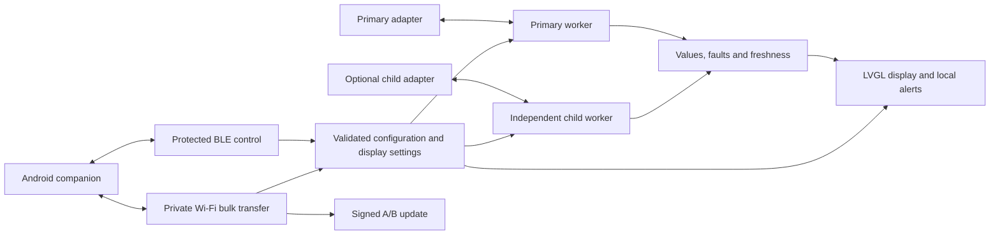

# System architecture

The gauge owns vehicle sampling and runs without the phone after setup. Android
owns local vehicle dashboards, gauge associations and reviewed configuration.
See [current state](../current-state.md) for installed versions and qualification;
[source map](../ai-context.md#source-map) for implementation entry points.

```mermaid
flowchart LR
    ECM[Primary adapter] <--> Worker[Primary worker]
    TCM[Optional child adapter] <--> Child[Independent child worker]
    Worker --> Cache[Values, faults and freshness]
    Child --> Cache
    Cache --> UI[LVGL display and local alerts]
    Phone[Android companion] <--> Owner[Protected BLE control]
    Phone <--> Bulk[Private Wi-Fi bulk transfer]
    Owner --> Config[Validated configuration and display settings]
    Bulk --> Config
    Bulk --> OTA[Signed A/B update]
    Config --> Worker
    Config --> Child
    Config --> UI
```

## Ownership

| Owner | Responsibility | Boundary |
| --- | --- | --- |
| Per-adapter worker | Discovery/connect, ELM transaction, CAN header, polling, diagnostics and retry | One outstanding request per adapter; independent sessions and backoff |
| Application/UI owner | LVGL, local alert evaluation, settings and page gestures | Does not wait on adapter/network/flash IO |
| Companion | Authenticated owner commands and bounded queued work | BLE callbacks do not execute blocking operations |
| Configuration transfer owner | Inactive slot write, validation, commit and trial recovery | One configuration/OTA operation gate; no partial active document |
| OTA/Wi-Fi owners | Signed inactive image, encrypted bulk IO, activation and boot reconciliation | Bounded IO and cleanup; exact image identity establishes success |
| Android AppModel and coordinators | Lifecycle, operation leases, scoped protected polling and acknowledged UI state | One operation owner; no replay of uncertain mutations |
| Android local setup store | Vehicle drafts and remembered gauge assignments | One serialized durable commit for coupled state |

Detailed task/lock/buffer ownership is maintained in [firmware runtime](firmware-runtime.md)
and [Android runtime](android-runtime.md). Shared failure patterns belong in
[interaction recovery](interaction-recovery.md).

## One logical vehicle

A normal vehicle has one adapter. Its dashboard includes engine and transmission
readings regardless of their ECU responder. A swap can configure a second adapter
as a child in Expert. That changes only transport routing, not available editors,
page/alert lists or the logical vehicle. Each missing source becomes unavailable
independently while its healthy sibling continues. See [vehicle connections](vehicle-connections.md)
and [multi-adapter implementation](multi-adapter.md).

Definition identity, ECU responder, source, session, configuration revision and
monotonic freshness remain distinct. A catalog entry is executable definition
coverage, not evidence a particular vehicle supports it. Missing data is unavailable,
never a synthetic zero. Canonical metric values are converted at presentation and
alert-editing boundaries; saved rules retain canonical values.

## Persistence and compatibility

Android uses SharedPreferences-backed local stores. Profile and gauge-association
state is coupled through `LocalSetupStore`; legacy documents are migration inputs.
There is no Room or DataStore implementation. See [storage and recovery](android-runtime.md#storage-and-recovery).
Gauge configuration uses two reserved generation slots, readback and a durable commit
marker with trial recovery. Display settings and owner/bond state have separate
versioned NVS records. See [configuration storage](config-storage.md).

The implemented wire path is [protected development protocol 0](../protocol/experimental-firmware-transfers.md),
with capability negotiation; the [general BLE v1 envelope](../protocol/ble-v1.md)
is proposed. Signed development App/Wi-Fi updates are implemented. Public production
capability flags and qualified link count remain gated by observed evidence.

## Bounds and remaining work

Configuration permits eight pages, two channels per Dual page, 32 active definitions,
32 alerts and 64 KiB. Runtime response buffers and worker deadlines are documented
beside their owners in [firmware runtime](firmware-runtime.md), not inferred from
larger research/discovery proposals. Curated definitions have bounded decoders;
arbitrary scripts, controller writes and code clearing are not implemented.

Simultaneous two-adapter-plus-phone software exists; physical coexistence remains
unqualified. Broader discovery, telemetry, sensors and production trust are tracked
in the [backlog](../backlog.md). Proposed hardware choices live in
[hardware strategy](hardware-and-transports.md), not the current ownership model.
