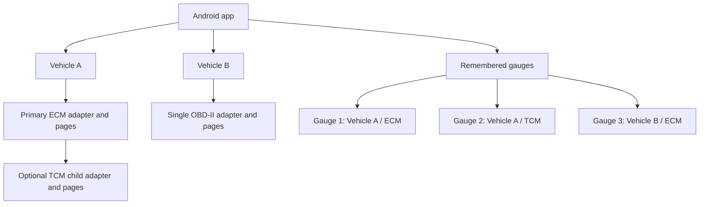

# Vehicles, primary adapters and transmission children

Updated 2026-10-07. This describes Android storage and setup behavior. It does not
promote simultaneous adapter capability.

## Ownership

A phone keeps up to eight vehicle profiles and sixteen remembered gauges. A normal
vehicle has one primary OBD-II adapter and engine draft. A swapped vehicle can add
one optional transmission child inside that same profile. The child has its own
adapter binding and saved pages; it does not consume another vehicle slot.

The parent relationship is configuration ownership, not a radio dependency. TCM
recovery must not wait for ECM availability. Adapter identity and source/ECU keys
stay independent. A vehicle-wide shared fault list or parser must not erase source
attribution. A child is optional and remains absent from ordinary setup.

## Android implementation

- `VehicleProfile` owns the primary `draft` and `primaryAdapter`, plus optional
  `TransmissionConnection(adapter, draft)`. `draftFor`, `adapterFor`, `withDraft`
  and `withAdapter` select the correct source without altering its sibling.
- Profile schema 6 serializes the child within the vehicle. Schemas 1 through 5
  remain readable. Existing standalone TCM profiles remain intact: the app never
  guesses which engine vehicle is their parent.
- Expert exposes the child setup and source selection for the selected gauge.
  Explicit legacy attachment moves its pages/binding into a chosen engine vehicle;
  the installed gauge still needs a reviewed send to adopt the new vehicle ID.
- A child needs an ECM parent with an adapter selected. Parent/child adapter IDs
  and addresses must differ. Reject duplicate selection without overwriting either
  binding. Remove the child before removing the primary adapter. Replacing the
  primary retains the vehicle's child unless the replacement conflicts with it.
- Removing a child asks for confirmation because it deletes its phone draft.
  Installed gauges keep their configuration. Stale local assignments are marked
  for review and never resolve to another vehicle or source.
- `GaugeAssociationStore` migrates the old single identity without deleting it or
  its name. Each `KnownGauge` stores its desired vehicle/source context. Settings
  offers a saved-gauge picker and explicit discovery for another gauge.
- The phone connects to one selected gauge at a time. Reconnect restores that
  gauge's desired vehicle/source draft. Switching clears device evidence, waits
  for automatic transport cleanup and does not send settings. Ownership always
  requires the Android bond plus protected readback, independently for each gauge.
- Pending configuration/update outcomes must be reconciled before switching gauges.
  Corrupt associations fail closed; retain the raw stored document for recovery.
- Poll scope includes gauge, vehicle, source, adapter and configuration revision.
  A late read for a previous source is discarded even when its parent vehicle is
  unchanged. Local desired assignments never establish healthy installed setup.

## Firmware and protocol boundary

Current firmware executes one configured source and advertises `maxAdapterLinks=1`.
Both an ECM gauge and a TCM gauge may project the same `vehicleProfileId`, using
separate source roles and bindings in the existing schema-2 wire document. Local
profile schema 6 and gauge association schema 1 do not change BLE opcodes or packet
layouts. They do not install two sources on one gauge.

The target in [multi-adapter support](multi-adapter.md) remains two independent
central links on one gauge plus the phone. Gate that configuration until independent
snapshots, mixed-source pages/alerts, link isolation, coexistence and hardware soak
are implemented and qualified. Never hide a failed required child behind a healthy
parent in the universal connection pill.

## Verification

`VehicleHierarchyTest` covers nested persistence, legacy migration, duplicate radio
rejection, parent invariants, independent gauge contexts, invalid associations and
source-specific wire projection. `VehicleHierarchyUiTest` covers Expert child setup,
explicit removal, gauge selection and Car-to-Expert routing using isolated examples.
Two adapters and multiple physical gauges still need field qualification; tests and
UI fixtures do not establish that physical behavior.
