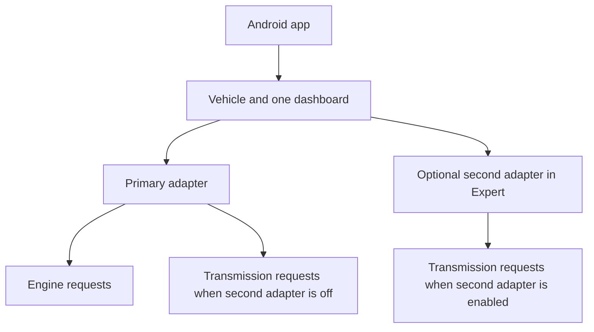

# Vehicles and adapter routing

Updated 2026-10-07. One vehicle dashboard is independent of its physical adapters.

## Product model

A phone stores up to eight vehicles and sixteen remembered gauges. Every vehicle
has one primary logical connection, ECM, and one dashboard containing its supported
engine and transmission readings. A swap may explicitly enable one optional second
adapter in Expert. It belongs to the primary vehicle; it is never a second car.

One adapter is the normal case. All configured definitions use that transport,
keeping their own CAN request/response identities. A second adapter only changes
where transmission definitions are polled. No page editor, preview, Actions picker
or send review selects an ECM-only or TCM-only subset.

Each physical connection recovers independently. Missing engine data cannot prevent
transmission data from displaying, or the reverse. Keep pages visible with unavailable
values for absent data. Do not erase source/ECU identity in parsing, diagnostics,
commands or freshness merely because the product has one logical connection.

## Android implementation

`VehicleProfile` retains primary and internal child drafts for backward-compatible
storage. `dashboardDraft()` is the logical editor; it includes both page sets and
legacy TCM-only profiles. `withDashboard()` stores edits without changing bindings.
`projectVehicle()` sends every dashboard page and changes only definition routing
when the second adapter is enabled. Mixed-controller Dual pages are supported by
new firmware. Page order and gesture targets survive route changes.

Expert selection edits a binding, never a page source. Car always edits the primary
binding. Reconnection restores the whole vehicle editing context. Actual installed
source roles drive protected status polling until a reviewed replacement is sent.
Each remembered gauge retains its vehicle association and explicit second-adapter
mode. Separate vehicles and gauges never inherit one another's bindings.

Schema 10 allows mixed primary pages and retains reads of schemas 1..9. Child page
identities keep their existing `child.` prefix; this is an internal identity rather
than a separate dashboard. A legacy TCM profile keeps its ID and binding, offers
engine readings, and normalizes its primary draft when edited. It does not guess
which other saved car is its parent. Explicit legacy attachment remains available
for recovering an older separate profile. Confirmed protected single/dual gauge
readback can recover a missing vehicle without overwriting an existing ID.

A vehicle keeps at least one page, and the phone keeps at least one vehicle. A
controller's internal draft may be empty. Both configured adapters can still check
faults without having a display page assigned. Unfinished or same-radio child
bindings cannot enable two workers; single mode uses the primary transport for the
whole dashboard. Removing a child route retains all pages/gestures.

## Firmware and compatibility

Source dev.45 adds `va:1`: request service and expected responder belong to each
PID, with bounded serialized CAN header changes. Sources describe transports.
One transport can carry standard 7E8 and captured enhanced 7E9 requests. A second
source routes the enhanced definitions to its independent worker. Public link
capacity remains one until the physical coexistence matrix passes.

Configuration schema remains 2. An older firmware lacks `va:1`; Android blocks the
new mixed/second-adapter payload rather than dropping pages. Older phone Apps reject
new schema-10 storage. Firmware freshness, source generations and unknown replies
continue to fail closed. TCM alerts and TCM faults on a shared primary transport are
not qualified capabilities. Existing enhanced definitions remain calibration-specific.

See [detailed review and test plan](../development/logical-vehicle-review.md) and
[dual recovery matrix](../development/dual-adapter-recovery.md).

## Deleting phone data

Customize and Manage pages expose confirmed page deletion. Target gestures are
cleared, reading alerts remain, and a reviewed send changes the gauge.

Car > Your car exposes confirmed vehicle deletion. Persistence must succeed before
selection changes. Pending setup/update outcomes block deletion. Installed settings
and bonds remain unchanged; affected remembered gauges need explicit reassignment.
Choosing a different vehicle resets that gauge's local second-adapter mode. Other
gauges keep their own assignments. Corrupt associations fail closed and remain
recoverable; they never silently select another vehicle.
