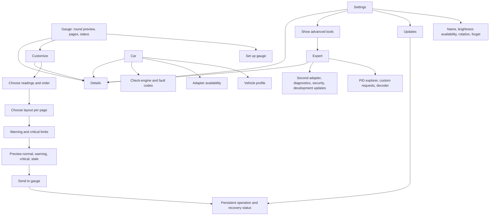

# eGauge: your display, first

> Scoped design history. Current UI rules are in [the design system](../design-system.md);
> implemented support is in [current state](../../current-state.md).

The round display is the visual centre. Graphite surfaces, a precise lime accent, large tabular values and generous controls replace dense diagnostic panels. Light mode uses warm neutral surfaces and dark green controls. Optional Android dynamic colour changes app chrome; critical, warning and the gauge preview retain their semantic colours. No decorative marketing copy.

## Information architecture

Compact windows use a bottom navigation bar. Medium (600 dp) and expanded windows use a rail. At 840 dp content becomes preview + task panes; narrow or enlarged-text windows stack and scroll. A fold hinge is treated as an exclusion region. Customize and setup are nested journeys with predictive back; backing out retains local edits and leaves device operations owned by the ViewModel.

## Flows and honest boundaries

| Journey | Steps | Success and recovery |
| --- | --- | --- |
| First run | Open app → Automatic discovery → Choose only if multiple gauges → Open pairing on display → enter physical code in Android → Automatic protected check → Adapter → Choose readings | Owner success requires a protected response. Adapter unavailable is explicit; continue designing without fabricated telemetry. Never reset an existing bond to demonstrate first run. |
| Customize | Choose up to eight pages → arrange readings → choose each layout → coolant limits → preview four states → review all pages and alert → Send to gauge | The reviewed `Draft` is the sender's captured input. Unsupported page/source/layout blocks send. Current protocol supports coolant alerts only; other alerts show unavailable. |
| Send preflight | Automatic owner reconnect → check saved settings → compare with local settings → Send to gauge | Keep optimistic concurrency guard. A newer remote revision requires another review. Do not silently rebase and immediately send. |
| Confirmation | Sending → Checking → Restarting → Checking gauge → Saved & running on gauge | Requires exact running revision + digest + cleared trial, with no previous-generation recovery. Storage confirmation alone is insufficient. |
| Unknown / failed send | Persistent “We could not confirm your changes” → Check gauge → compare saved and running → review → explicit retry | No auto retry, no automatic commit replay, no success toast based on elapsed time. Rollback remains visible. |
| Update | Check for updates → Update available → Install → Downloading → Sending to gauge → Restarting → Done | Current release source is development-only and public OTA is disabled. Default Updates explains unavailable; Expert retains the signed development path. Never relabel a development package as a stable update. |
| Clear codes | Inspect codes → Clear codes → explicit consequence dialog → clear → fresh readback | Current native clear path is unavailable. Prototype dialog is labelled Example. Clearing may erase diagnostic information and reset emissions readiness; permanent codes may remain. No real clear command is added. |

## Component inventory

| Component | Required behaviour |
| --- | --- |
| Status card | One human sentence + named icon; warning/error/unknown always visible; one recovery action |
| Connection pill | Searching, connecting, Gauge ready after a recent protected read, or reconnecting; never imply live telemetry |
| Round preview | All five layouts, normal/warning/critical/stale/offline states, visible Preview label; separate scalable text equivalent |
| Reading tile | Familiar name, unit, selection state; technical IDs only in Details |
| Page carousel | Named accessible pages, current position; swipe or tap without changing stored editor intent |
| Limit editor | Warn above / Critical above, explicit °C, validation; reset margin and timing in Details/Expert |
| Progress stepper | Named stages; transfer 100% is not “Done”; operation survives navigation |
| Details sheet | Selectable full text; revision, digest, IDs, raw bytes/JSON, board, partition, signature; no secrets |
| Empty/error panel | Honest unavailable or stale state, one next step; never a fake disabled working feature |
| Primary action | One filled action per screen; other actions are text/outline/list rows; 48 dp minimum target |

All components share the eight-state fixtures in `design/fixtures/ui-states.json`: default, loading, disabled, error, success, stale, offline, critical. Compose previews and screenshot checks use those fixtures. Browser mockups are design simulations, not evidence of device behaviour.

## Review artifact

Open [the interactive prototype](../../../design/prototype/index.html). The screen selector contains setup, pairing, gauge, readings, limits, car, update and recovery, plus Settings and Expert. Theme and viewport controls cover light/dark, compact/expanded. Gallery mode places the eight key screens together. The prototype never talks to a gauge or car. Mock pairing codes and all displayed measurements are explicitly examples.

## Delivery boundaries

1. Design foundation: audit, copy inventory, tokens, interactive concept, baseline screenshots.
2. Android presentation: generated design-system module, immutable state, adaptive shell and feature flows, trust mapping fixtures.
3. Verification: screenshot goldens, journey/accessibility checks, Pixel captures and documentation. Each PR runs build, unit tests, instrumentation compilation, lint and repository validation.

Prior UX review A01-A10 remains a regression checklist, especially A01 runtime confirmation, A02 operation ownership, A03 age/scoping, A04 association, A06 exact review/payload and A07 accessibility. Firmware, LVGL, transport codecs, security gates and public flags are outside this redesign.

## Android foundation dependency

The design-system module uses `MaterialExpressiveTheme` from Material 3 `1.5.0-alpha13`, pinned to keep the existing Android API 36 / AGP 8.13 toolchain. The stable 1.4.0 artifact makes the expressive APIs internal; newer 1.5 alphas require a wider toolchain upgrade. Dependency verification remains enabled with checked hashes. This is a deliberate prerelease UI dependency and should be reviewed before production distribution. [Official Material 3 release notes](https://developer.android.com/jetpack/androidx/releases/compose-material3).

## Foreground connection behaviour

Discovery starts on entry after Android permission. The remembered target is never silently replaced by another advertiser. Initial owner association still requires the physical code. Existing owner access is checked automatically; entering the background cancels automatic work, and a user transaction waits for its cleanup before taking the operation lease. Reads refresh about every 20 seconds; failure delays grow from 2 to 30 seconds and rediscover the same gauge. No automatic send or update replay is allowed. Offline state and unresolved transaction outcomes remain independently visible.
