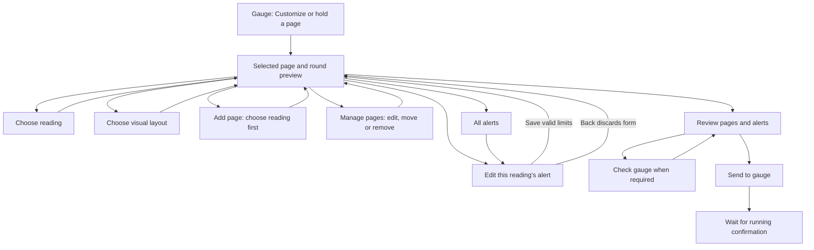

# Customize usability review and revamp

The selected gauge page is now the editing workspace. Swipe the round preview to choose a page, then change its reading, layout or alert in place. Focused pickers replace the long editor and the separate edit-page landing screen. The only filled action is kept at the bottom: **Review and send**, **Save alert** or **Done**, depending on the task.

## Audit

| Previous element | Job and exposure | Finding | Resolution |
| --- | --- | --- | --- |
| Dashboard, then Edit page | Customize a page; default | High: a full preview and another navigation step separate the controls from their result | Merge into one workspace with preview and compact controls |
| All readings and all layouts in one scrolling editor | Choose content and appearance; default | High: the relevant choice and completion action can be several screens away | Searchable reading sheet; visual layout sheet; a choice closes its sheet |
| Add page | Add content; default | High: immediately creates a duplicate RPM page before the user chooses anything | Choose the reading first; dismissing the picker creates nothing |
| Manage pages | Organize pages; default | Medium: four repeated buttons make every card large; Edit returns to another landing screen | Compact numbered rows; tap to edit; named options for moving/removing; confirm the exact page before removal |
| Separate alert list | Customize limits; default | High: the user must locate the reading again | Each page has contextual alerts for its reading(s); All alerts includes readings not on a visible page |
| Temperature increment/decrement control | Set any reading's thresholds; default | Critical usability defect: RPM and speed use a Celsius label and temperature bounds; large values take many taps | Unit-aware number fields, reading-specific bounds and inline errors |
| Save alert | Commit a change; default | High: every keystroke and adding an alert had already persisted, so Back also saved | Keep an immutable local form; Save commits once; Back discards; opening a new alert invents no thresholds |
| Direction and reset behavior | Tune an alert; default/detail | High: changing direction could leave invalid limits; reset and delay values lacked an editing affordance | Validate ordering; disclose reset/delay under Alert behavior; preserve priority and existing timing |
| Oversized preview on every subpage | Check appearance; default | Medium: displaces the task and primary action | Workspace preview stays prominent; alert preview is optional with normal/warning/critical/stale examples |
| Send review | Review a real device change; default/detail | Medium: dual pages did not name their second reading | Summarize every page, both readings and every alert; retain all blockers and protected send logic |

## Workflow

When opened from All alerts, the alert editor returns there. A reading has one alert across pages. Removing a page retains its reading's alert and the removal dialog says so. Changes remain on the phone until the explicit send step.

## Components and accessibility

- Fixed header and primary footer around a scrolling form. The keyboard moves the footer above it. Expanded layouts put the preview and controls side by side; large text stacks them.
- The page counter stays on the preview. Swipe and hold match Gauge. Reading remains a visible alternative to holding; page management and named accessibility actions provide alternatives to swiping.
- Reading picker has search, selected state and an honest empty result. Layout choices show labelled miniatures and identify any preview-only renderer.
- The generic limit field accepts a unit and an error. Delays accept up to millisecond precision; thresholds retain the existing integer contract. Existing alert identifiers, timing and priority survive edits.
- Headings, selected states, named controls, minimum 48 dp action targets, field error semantics and polite error announcements follow [Compose semantics guidance](https://developer.android.com/develop/ui/compose/accessibility/semantics). Choice sheets follow [Compose bottom-sheet guidance](https://developer.android.com/develop/ui/compose/components/bottom-sheets).
- Existing graphite/lime color, type and shape tokens are reused. This is a workflow and component change; no new token, firmware or renderer changes are needed.

## Scope and truthful behavior

The picker exposes the readings the existing configuration path can send: engine speed, coolant temperature, vehicle speed, engine load and fuel level. Each uses the same alert workflow. Older pages with an unavailable reading remain editable and explain how to choose an available one. This review does not implement arbitrary custom-PID transmission, live vehicle discovery or telemetry. Those remain subject to the existing verified capabilities. Examples and previews stay labelled.

Authentication, physical-code association, signed updates, wire formats, transfer outcomes and the running-revision/hash/trial confirmation rule are unchanged. The whole-number RPM ceiling now respects the decoder's 16383.75 maximum. Profiles saved with the former 16384 ceiling remain readable so the user can correct them before sending. Critical and unknown operation outcomes remain visible in the existing app-level status UI. No clipboard action is introduced.

## Image evidence

Before images are the committed Pixel-rendered fixtures at the parent commit. After images come from the revised production composables with explicitly labelled example data. They demonstrate UI behavior, not live vehicle or gauge behavior.

| Journey | Before | After |
| --- | --- | --- |
| Customize workspace | [Before](customize-review/before/readings-light-390.png) | [After](../../../android/app/src/androidTest/assets/goldens/readings-light-390.png) |
| Choose layout | [Before](customize-review/before/layouts-light-390.png) | [After](../../../android/app/src/androidTest/assets/goldens/layouts-light-390.png) |
| Reading alerts | [Before](customize-review/before/limits-light-390.png) | [After](../../../android/app/src/androidTest/assets/goldens/limits-light-390.png) |
| Review and send | [Before](customize-review/before/review-light-390.png) | [After](../../../android/app/src/androidTest/assets/goldens/review-light-390.png) |
| Expanded dark workspace | [Before](customize-review/before/readings-dark-1000.png) | [After](../../../android/app/src/androidTest/assets/goldens/readings-dark-1000.png) |

The new [page manager](../../../android/app/src/androidTest/assets/goldens/pages-light-390.png) and [unit-aware alert form](../../../android/app/src/androidTest/assets/goldens/alert-light-390.png) have dedicated shared fixtures. Verification results are recorded in the Android UX validation document.
