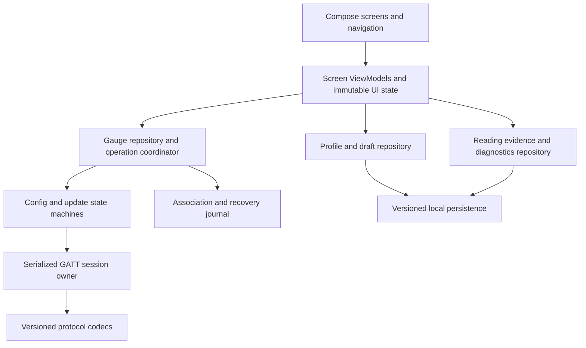

# Android companion core and UX review plan

Date: 2026-09-26. Reviewed commit: `9de0f88e81d3b45b641a5107d745fc0c32911779`, branch `feat/owned-gauge-control`.

Status: software implementation completed on the integration branch; deterministic validation is recorded in [Android core and UX implementation validation](android-core-ux-validation.md). Phone accessibility/performance, participant usability, hosted-release installation, OBD, and dual-adapter gates remain external qualification work. This document retains the original findings and acceptance criteria as historical context. It is the Android counterpart to the [firmware review plan](firmware-core-review-plan.md).

## Outcome and priorities

Make the companion easy to use for its primary job: connect a gauge, choose useful readings, arrange the round display, configure alerts, and know that the gauge is running the intended settings. Vehicle fault information and firmware updates must remain easy to find. The gauge continues to work independently after configuration.

Retain detailed diagnostics, custom PIDs, and separate ECM/TCM adapters. Put specialized controls behind clear contextual entry points. New profiles start with one OBD adapter. Do not require users to understand ECU roles, protocol revisions, hashes, or transfer phases to complete ordinary setup.

Priority order:

1. Trustworthy device identity, operation ownership, freshness, and confirmation of running configuration.
2. Task-oriented navigation and a usable single-adapter setup and editor.
3. Readability, accessibility, and understandable recovery paths.
4. Advanced discovery, diagnostics, and optional dual-adapter controls with honest capability boundaries.
5. Measured performance, lifecycle resilience, and maintainable documentation and tests.

Everyday, thermal/off-road, performance, and diagnostic uses remain supported product directions. Single adapter is the default connection topology, not a restriction on which readings users can configure. This plan does not assume that a transmission reading requires a second adapter: several ECUs may share one adapter.

## Review scope and evidence

Reviewed all nine Kotlin production files, the two existing unit tests, manifest/build configuration, local profile persistence, Compose screens, BLE discovery/control, configuration/readback/update flows, and current design and protocol documentation. `MainActivity.kt` has 1,111 lines combining platform integration, operation orchestration, and all screens. `AppModel.kt` has 421 lines of mixed domain, operation, and presentation state. These sizes are context for ownership problems, not defects by themselves.

Source references below are relative to the reviewed commit. **Confirmed** means directly visible in source. **Risk** means a plausible failure requiring a targeted reproduction. Pixel and gauge results in earlier validation records remain historical evidence. No current screenshot, TalkBack session, jank trace, or live OBD test was captured for this review.

Retain the working foundations: Material 3 controls, ViewModel ownership for updates, explicit simulated values, bounded update package import with signature checking, authenticated state readback, revision/hash conflict checks, profile corruption protection, and a lazy PID list. Refactor incrementally around them.

## UX method

Use **task analysis plus progressive disclosure**, assessed with Nielsen's usability heuristics and checked through task-based usability sessions. Progressive disclosure is an established way to defer infrequent complexity; the exact navigation proposed here remains a design hypothesis until tested. [NN/g: progressive disclosure](https://www.nngroup.com/articles/progressive-disclosure/).

Define the primary tasks before arranging screens. Review each flow for visible status, familiar language, error prevention, recovery, consistency, and recognition rather than recall. Record severity and task impact instead of treating visual preference as evidence. [NN/g: usability heuristics](https://www.nngroup.com/articles/ten-usability-heuristics/).

Use two presentation levels within a task:

| Default task view | Contextual detail view |
| --- | --- |
| Gauge name, last contact, owner access, usable actions | Board, protocol, capabilities, association identifiers |
| Reading name, unit, availability, example/live/stale status | PID/service, ECU/source identity, decoder, response bytes, provenance |
| Warning and critical limits with plain-language behavior | Hysteresis, dwell, missing-data behavior, source/rate details |
| Changes waiting to send, transfer stage, running confirmation | Revision, full digest, operation ID, result code, stored/running comparison |
| Check-engine status, available code counts and age | Code categories, first-code limitation, responder information, raw snapshot |
| Update version, compatibility, progress, recovery action | Signature identity, hash, partition, trial state, bounded event log |

Critical alerts, stale data, rejected changes, rollback, incomplete diagnostic results, and unresolved transfer outcomes stay visible in the default view. Technical details are expandable and copyable. Expert tools have predictable named destinations, not hidden gestures or an undocumented global developer switch.

## Findings and required changes

### A01. Configuration success is stronger than its evidence

**P1, confirmed.** [GaugeConfigTransferClient.kt](../../android/app/src/main/java/com/lstepnio/egauge/GaugeConfigTransferClient.kt), lines 471-496, confirms the durable revision/hash after commit. It does not call `readRuntimeIdentity` or wait for the configuration trial flag to clear. [AppModel.kt](../../android/app/src/main/java/com/lstepnio/egauge/AppModel.kt), lines 256-269, then says the profile is active. The firmware now distinguishes stored, running, trial, and recovered generations.

**Change:** typed transaction states: preparing, sending, verifying, saved, restarting, checking running configuration, active, recovered, failed, outcome unknown. Success requires the expected running revision/hash and a cleared trial flag. Keep durable and runtime evidence separate. A connection loss around commit is unknown until reconciled; a timeout must not say commit succeeded without evidence. Refresh capabilities after a confirmed restart rather than manually editing cached flags.

**Acceptance:** a committed but unconfirmed trial never shows Active; previous-generation recovery remains visible; lost commit acknowledgment reconciles without blindly repeating commit. Matching storage alone cannot satisfy the active-state test.

### A02. Operations have split owners and one misleading busy flag

**P1, confirmed design issue; overlapping-session impact requires reproduction.** [MainActivity.kt](../../android/app/src/main/java/com/lstepnio/egauge/MainActivity.kt), lines 151-316, launches most BLE work in `lifecycleScope`; update work runs in `viewModelScope` in AppModel, lines 370-389. `scanning` represents scanning, reads, writes, and transfers. `requestActiveConfiguration` clears it through `configStatusRead` before the second runtime-identity read finishes. Clients create independent GATT connections without a shared application operation arbiter.

**Change:** repository-owned operation coordinator with one exclusive mutation/maintenance lease per gauge, a serialized GATT request owner, typed progress/errors, and immutable screen state. Activity owns only permissions, document picker, and window integration. Rotation must not cancel a configuration transfer. Preserve cancellation semantics through reconnect loops, including broad `runCatching` blocks that currently also catch coroutine cancellation.

**Acceptance:** double taps and competing reads cannot start conflicting sessions; rotation retains operation identity; cancellation closes resources exactly once; old responses cannot complete a newer operation or clear its busy state. Navigation stays usable while a persistent operation banner tracks work.

### A03. Cached evidence is not consistently scoped to a gauge or aged

**P1, confirmed.** `Diagnostics` stores boolean freshness but no receipt time ([GaugeConfigTransferClient.kt](../../android/app/src/main/java/com/lstepnio/egauge/GaugeConfigTransferClient.kt), lines 39-42). The UI reuses those flags indefinitely (MainActivity, lines 1031-1050). `connected` clears several snapshots but not `bootIdentity`; `connectionError` leaves some revision/sent/boot state behind (AppModel, lines 214-244). Data objects do not carry a gauge identity/session generation.

**Change:** wrap observations with gauge ID, session generation, profile/source where relevant, and monotonic receipt time. Derive age in the UI; after expiry or process restart, show last-read/unknown until refreshed. Firmware freshness at read time does not establish indefinite live freshness. Clear or explicitly archive all device-specific state on target changes and ownership loss.

**Acceptance:** reading diagnostics once cannot leave a permanent current MIL indication; switching between two fake gauges never mixes their boot/configuration state; returning after suspension ages all observations correctly. Persisted snapshots are labeled historical until revalidated.

### A04. Discovery selects the first advertiser and has no durable association workflow

**P1, confirmed.** [BleCapabilityClient.kt](../../android/app/src/main/java/com/lstepnio/egauge/BleCapabilityClient.kt), lines 309-337, returns the first matching scan result. `selectedDevice` is memory-only. Pairing is embedded in saved-state/control operations, while transfer operations require an existing bond. A user can reach a transfer that says to pair without a clear direct setup action.

**Change:** guided association with a candidate picker when needed, recognizable gauge identity, explicit owner-authentication state, remembered association, and reconnect to the selected gauge. Keep OS bond and firmware owner authorization distinct. Evaluate platform association support against the custom owner flow before adoption. Centralize permission/radio checks and recovery, including denied/permanently denied permission and legacy Android location-service requirements.

**Acceptance:** two identical names do not cause silent target changes; public discovery never says owner control is ready; bond removal, stale bond, another owner, cancellation, and permission revocation each produce one clear next action. Do not use RSSI as proof of identity.

### A05. The default screens expose development machinery and niche topology

**P2, confirmed.** Garage always shows ECM and TCM rows (MainActivity, lines 524-526). The PID screen always exposes source filters, discovery simulation, and decoder/custom-request labs (lines 803-901). Device leads with board/protocol/adapter slots (lines 945-960). `Header` labels every screen DEMO DATA, including real authenticated status (lines 397-410). Garage copy says device configuration needs a future secure operation despite the implemented numeric subset (lines 515-520).

**Change:** apply the proposed information architecture below, localize example labels to simulated content, and replace engineering prose with task status plus an accessible details link. Keep development experiments labeled and outside the routine path. Explain available configuration scope in terms of what will appear on the gauge.

**Acceptance:** default setup never asks ECM versus TCM; actual readback is not labeled demo; a new user can identify the next action and distinguish example readings from vehicle observations.

### A06. Editor intent and transmitted configuration can differ

**P1, confirmed.** `Draft` defaults to Arc (AppModel, line 59). All five layouts appear selectable. General Apply is permanently disabled, but the experimental numeric button can send an Arc draft as three numeric pages ([MainActivity.kt](../../android/app/src/main/java/com/lstepnio/egauge/MainActivity.kt), lines 705-731; transfer client, lines 207-232). The explanation exists below the controls, but the preview and payload still express different outcomes. The comparison covers a subset of fields, not the complete document.

**Change:** derive the review preview, eligibility, and payload from one typed configuration projection. For the current firmware, default to supported numeric pages. Keep unsupported layouts in an explicit preview-only mode. Before send, show every page and alert actually included, including template-added pages. No silent conversion or omission. Summarize differences in everyday language, with a full comparison available on demand. Label partial comparisons as partial.

**Acceptance:** what the send review depicts equals the payload; unsupported renderer/source cannot quietly become numeric/ECM; import preserves unsupported fields or refuses destructive replacement; draft edits during sending do not change the captured transaction.

### A07. Readability and accessibility are not covered by interaction tests

**P2, confirmed structural risks; rendered impact unmeasured.** Many essential labels are 11-14 sp. Send buttons have fixed 50 dp height, preview content uses fixed offsets inside a 238 dp circle, `InfoLine` has a fixed 112 dp label column, and threshold buttons expose bare plus/minus labels. Navigation uses text glyphs. There are no Compose accessibility tests in the current source tree.

**Change:** shared semantic typography, minimum rather than fixed button heights, adaptive label/value stacks, named icon assets, semantic control labels and state, proper focus order, and localized strings. Preserve the round preview's device geometry while providing a separate scalable accessible description. Do not shrink app text to make the preview fit.

**Acceptance:** 200% font scale, narrow width, landscape, keyboard/insets, TalkBack, and switch access retain essential labels/actions. No color-only warnings. Full identifiers remain available without truncation in details.

### A08. Local persistence and protocol rules need independent boundaries

**P2, confirmed.** [ProfileStore.kt](../../android/app/src/main/java/com/lstepnio/egauge/ProfileStore.kt) serializes the entire profile collection on every edit, uses asynchronous `SharedPreferences.apply` without a durable-save state, and silently coerces some unknown fields. Validation is repeated in the editor, ViewModel, sender, storage, and comparison code. `draftComparison` reparses JSON on access. There are no migration or store tests.

**Change:** one typed draft validator and capability projection; a versioned repository with explicit persistence results and migrations; parsed immutable document models. Use DataStore for small settings/profile documents initially, adding Room when queryable catalogs and observed discovery records justify it. Preserve the original data when unsupported schema or field values cannot be mapped safely. Document canonical units and conversion rules; preferences alone must not alter physical thresholds.

**Acceptance:** old and dual-source profiles migrate without field loss; disk/write failure is not called Saved; rapid edits retain the final intended value; invalid imports and new schemas cannot silently become a valid different configuration.

### A09. GATT/protocol code has duplicated mechanics and weak event bounds

**P2, confirmed structure; callback race impact unmeasured.** Discovery, saved-state, and controls repeat callback/bond/timeout logic. Transfers use `Channel.UNLIMITED` and rely on next-event type ordering (transfer client, lines 55-168). Wire constants and byte parsing share a class with Android transport and JSON generation. Broad exception-to-string handling loses actionable error identity.

**Change:** shared bounded GATT session abstraction with request identity, expected characteristic/event, deadlines, connection generation, and explicit overflow failure. Extract pure codecs with typed enums and version checks; reject invalid ranges instead of hiding malformed capabilities by clamping. Keep authentication behavior proven by existing pairing evidence. Define old/new protocol compatibility fixtures before extraction.

**Acceptance:** delayed, duplicate, wrong-characteristic, malformed, and old-session callbacks never satisfy the wrong request. Missing MTU/service callbacks time out cleanly. Link cleanup and bond retries stay bounded, with no unbounded event queue.

### A10. Update recovery is still a foreground development workflow

**P2, confirmed limitation.** Update runs in a ViewModel, holds its image in memory, reports upload percentage as prose, and reconstructs no operation after process death. The manifest has no transfer service. Verification/reboot/health stages are not distinct UI states. Existing signature and size checks are valuable and must survive refactoring.

**Change:** a stage-aware operation model and durable minimal recovery journal, followed by an explicit decision on supported background delivery. If background BLE transfer is offered, implement the appropriate foreground service and notification under current platform rules. Otherwise state the foreground-only behavior precisely. On restart reconcile device identity, image/configuration digest, and gauge status before offering retry. Keep production trust/key policy separate from the signed development path.

**Acceptance:** 100% uploaded is not called Installed; interruption before activation permits a defined retry, interruption after activation requires reconciliation; cancellation cannot abort a committed activation. Wrong board, signature, oversized archive, and mismatched image are rejected. [Android background BLE guidance](https://developer.android.com/develop/connectivity/bluetooth/ble/background).

### A11. App regression coverage is too narrow for its current responsibility

**P1 coverage gap, confirmed.** [PidLabTest.kt](../../android/app/src/test/java/com/lstepnio/egauge/PidLabTest.kt) has two decoder tests. No app tests cover ownership, transfers, runtime confirmation, profile migration, comparison, update validation, ViewModel state, or Compose journeys.

**Change:** add failure-oriented tests with each relevant package below. Use pure codec/state-machine tests, a fake gauge transport and clock, repository migration tests, Compose semantics/journey tests, and targeted physical tests. Shared vectors must exercise the actual Android and C parsers separately, not only a Python contract approximation.

**Acceptance:** each confirmed P1 defect has a regression fixture. CI builds, tests, lints, and verifies protocol/docs; emulator/device tests have recorded artifacts and an explicit execution lane.

### A12. Performance and documentation need measured, current contracts

**P2, confirmed evidence gap.** There are no app startup, frame, heap, or battery baselines. Fixed layouts and repeated JSON processing are optimization candidates, not established bottlenecks. Existing design/README documents mix current implementation with future architecture, and still present ECM/TCM rows as universal defaults.

**Change:** instrument representative journeys in a release-like build, then optimize measured hotspots. Consolidate operation/state vocabulary and capability matrices, document repository ownership and protocol invariants, and mark old UI concepts as historical where superseded.

**Acceptance:** before/after traces for each claimed performance improvement; no regressions hidden by debug-only measurements; one maintained mapping from user action to capability, protocol, implementation, and evidence.

### A13. Hosted multi-board releases need a new implemented path

**P1 release gate, confirmed gap.** The [manifest schema](../../contracts/release-manifest.schema.json) fixes one board, chip, layout, and protocol major 1, while the implemented transfer is protocol 0. Its image limit is 4 MiB, above the current 3 MiB OTA slot. [DevUpdateBundle.kt](../../android/app/src/main/java/com/lstepnio/egauge/DevUpdateBundle.kt) fixes the same single board and imports local development packages. The [manifest](../../android/app/src/main/AndroidManifest.xml) has no Internet permission; [CI](../../.github/workflows/quality.yml) builds one firmware target and does not publish releases.

**Change:** implement APP-08A/08B below with a versioned compatibility contract, registered board targets and per-target limits, network permission/client, signed release discovery, protected publishing, and independent on-gauge validation. Document migration from development protocol/trust to production, including a bootstrap path for existing devices. Reconcile schema limits with actual partitions.

**Acceptance:** an app cannot offer an incompatible catalog entry as installable, even if the file is correctly signed; current protocol-0 development images remain clearly separated from the future production contract; board support is explicit and independently qualified.

## Proposed information architecture

Use four destinations, with no extra top-level destination for advanced tools. Validate these labels with task testing before broad visual implementation.

| Destination | Primary content/action | Secondary routes |
| --- | --- | --- |
| **Gauge** | Round preview, page order, selected readings, alert summary, pending-change status; Edit / Review and send | Page editor, alert editor, supported layouts, comparison, configuration details |
| **Readings** | Find readings by familiar name/category; discover when supported; add to a page | Reading detail, evidence/source, request/decoder tools, imports |
| **Vehicle** | Active profile, one OBD adapter, check-engine status and fault-code entry | Profiles, adapter setup, vehicle diagnostics, advanced connections |
| **Settings** | Gauge association, display preferences, firmware update, help | Technical details, support export, development tools where appropriate |

First run offers **Set up my gauge** and **Explore a preview**. Setup is staged: find/select gauge, establish ownership with the physical code, then optional vehicle adapter setup and suggested readings. A missing adapter must not prevent pairing, local editing, or an honest offline preview. Required unsupported steps explain the current firmware limit and allow users to continue with available tasks.

The Gauge screen has one dominant next action for its state: connect, edit, review changes, check outcome, or resolve recovery. Do not show a permanently disabled general Apply alongside a competing experimental send. The current restricted sender can be presented as **Send numeric pages**, with a concise scope review and experimental label until promotion is justified.

### Normal editing and confirmation

1. Choose a reading by name and unit. Show its evidence state near the selection.
2. Choose an available layout and edit page order. Unsupported concepts belong to preview mode.
3. Configure alert thresholds. Show the affected reading and unit even if it is not the current page. Put delay/hysteresis under **Alert behavior**, with plain explanations and visible effective values.
4. Autosave the phone draft and show persistence failure if it occurs. Display **Changes not sent** independently of local save state.
5. **Review and send** shows the exact pages, alerts, target gauge/profile, and meaningful changes. Show blocking issues beside their fields with one next action.
6. Display sending, checking, restarting, and confirmation. Finish at **Running on gauge** only on authenticated matching runtime evidence after trial confirmation.

### Keep technical detail useful

Each status/error panel has a **Technical details** disclosure containing time, target, operation stage, full identifiers, and copyable error facts. Use readable labels such as **Gauge saved settings**, **Running settings**, and **Last checked**. Raw result numbers, hashes, partition addresses, and hex requests do not dominate the summary.

Vehicle fault diagnostics are a normal feature, not hidden in developer settings. Say **Check-engine light**, with MIL as an explanation in detail. Distinguish no fresh data from no faults. Show partial-code coverage clearly; the current snapshot supplies counts and first codes, not a complete list or identified responder. Future clearing remains a separate capability with explicit ECU scope, consequences, user confirmation, and post-action readback. Never replay a pending clear automatically after reconnect or process death.

Firmware update stays discoverable in Settings, with an operation banner accessible from every destination. A details link exposes trust/hash/boot information. Developer-signed package import stays clearly labeled; it must not masquerade as a production release service.

## GitHub firmware catalog and OTA delivery

Product requirement: publish firmware images for supported boards on **GitHub Releases in `lstepnio/ESP32OBD2`** and let the companion find, download, verify, and deliver the correct image to its associated gauge. Initial delivery is phone download followed by the authenticated BLE transfer. Direct gauge downloads over Wi-Fi are a later transport extension, using the same signed metadata and activation policy.

### User experience

**Settings > Firmware update** shows the installed version, last check, compatible available version, readable release notes, and **Download update** / **Install update**. The app selects by the gauge's reported hardware identity; normal users do not choose a board from a list or browse GitHub assets. An unidentified or unsupported board shows an actionable compatibility message and blocks installation.

Stable is the default channel. Beta/development channels require an explicit advanced preference and retain their label throughout download and install. No automatic firmware installation. Once downloaded and verified, a compatible cached package can be installed without Internet access; show when its release status was last checked. Rate limiting, offline state, and failed checks must not be reported as Up to date. Manual package import remains under advanced update tools.

Use distinct progress stages: Checking for updates, Downloading, Checking package, Sending to gauge, Verifying on gauge, Restarting, Checking new firmware, Installed or Recovery needed. Upload completion is not installation success. Technical details contain full board/revision, compatibility reasons, digests, signer, build commit, and validation results.

### Release contract and trust

- Extend and version the existing [release manifest schema](../../contracts/release-manifest.schema.json), rather than creating a competing format. Define a signed catalog/index envelope mapping available versions and channels to per-board manifest assets. Each image has an exact board ID, allowed hardware revisions, chip target, partition-layout ID, image length/hash, release sequence/version, protocol/config ranges, minimum bootloader/app compatibility, channel and signing key identity.
- Add a versioned authenticated gauge identity response for any required compatibility fields missing today. The current public board string and boot identity do not supply a full multi-board compatibility contract. Unknown hardware revision or layout must fail closed. Never infer compatibility from ESP32 chip family or filename alone.
- Version release assets by board, hardware range, layout, and release. OTA assets contain the application image and signed metadata; factory/USB bundles containing bootloader/partition data are separate and cannot enter the OTA picker. A layout migration requiring USB recovery is described explicitly, not attempted by the ordinary app updater.
- Verify signed catalog/manifest metadata against a pinned production trust root, then hash and validate the image before delivery. Firmware independently enforces its board/layout/image/signature policy. GitHub asset hashes and HTTPS are useful integrity/transport signals but are not substitutes for the project's signing trust.
- Specify canonical signed bytes, key rotation/revocation, release sequence and downgrade rules, catalog freshness/expiry, and persistence of the highest accepted catalog generation. An old correctly signed catalog must not silently authorize an obsolete or withdrawn release. Cached/offline installation needs an explicit bounded freshness policy and must disclose that recent revocations cannot be checked offline.
- Keep development trust separate from production trust. Private signing keys stay outside Git and app packages; only a protected release signing job gets narrow access. Document emergency recovery and compromised-key handling before publishing a stable channel. Never enable irreversible eFuse policy as a side effect of the Android update workflow.

### Publishing and retrieval

GitHub exposes releases and downloadable release assets through its APIs. Implement a release-source client behind an interface, keeping GitHub metadata separate from signed compatibility decisions. [GitHub releases API](https://docs.github.com/en/rest/releases/releases), [release assets API](https://docs.github.com/en/rest/releases/assets).

Use a pinned repository and HTTPS assets, handle GitHub's documented download redirects, and reject untrusted schemes/locations according to a tested download policy. Public downloads must not need a GitHub account or a token embedded in the APK. If private distribution is later required, design that authentication separately. Handle pagination, conditional cache requests, rate-limit responses, missing/replaced assets, bounded retries and interrupted downloads. Do not select the first `.bin` or trust `/latest` as the latest compatible firmware for every board/channel.

Stage downloads to an app-managed file with byte limits, space checks and a final atomic promotion after signature/hash validation. Network resume is allowed only when artifact identity still matches; otherwise restart the download. Network-download resumption and BLE-upload resumption are separate capabilities. Use scheduled/retryable Android work for network retrieval where appropriate, with a distinct user-started BLE operation owner.

Add a board build matrix with explicit toolchain, configuration, partition layout, board support package and validation status per target. Build from a release tag/commit, validate each image and manifest, sign through the release boundary, upload a draft release, verify the downloadable assets, then publish the catalog only when every referenced artifact exists. Published versions are not replaced in place; corrections use a new version. Retain known-good recovery artifacts and record withdrawals. GitHub build attestations can supplement provenance and release auditing. [GitHub artifact attestations](https://docs.github.com/en/actions/how-tos/secure-your-work/use-artifact-attestations/use-artifact-attestations).

Start with the currently supported Waveshare board. A catalog capable of multiple board entries does not make additional boards supported: each needs its own build target, flash/layout compatibility, display/touch setup, and hardware qualification. Keep the release channel honest about which targets are experimental or qualified.

### Release acceptance

Test catalog signature/freshness, stable versus prerelease selection, multiple boards and hardware revisions, same-chip wrong board, wrong partition layout, unavailable/partial releases, offline cached packages, rate limiting, interrupted/resumed download, changed asset contents, invalid signatures, rollback and config compatibility. An unrecognized board can inspect information but cannot flash. A fresh install of the companion must find and install a compatible published test release end to end without a manual file picker; record both production-path fixtures and actual phone/gauge evidence before stable promotion.

## Optional second adapter policy

Entry point: **Vehicle > Connections > Advanced connections > Second OBD adapter**. The nested settings route does not add mandatory setup steps to the standard workflow. A short explanation names the swapped-vehicle/separate-controller use case.

- Store topology per vehicle profile. New profiles default to Single adapter. Existing/imported profiles with a second source or TCM-bound content migrate to an explicitly visible advanced configuration, preserving all bindings.
- Enabling the preference opens setup for a second adapter, role/alias, identity, supported mode, and source-specific evidence. It is not proof of concurrency or a command to fabricate firmware support.
- Use **Vehicle adapter** in ordinary setup. Show **Engine (ECM)** and **Transmission (TCM)** only where role matters. In advanced profiles, distinguish source on readings, faults, pages, and alerts whenever ambiguity is possible.
- Separate adapter identity, source alias, ECU responder, and reading definition in the model. A single adapter can expose multiple ECUs; a dual-value gauge layout does not imply two adapters.
- Gate configuration/activation on actual firmware capability. Unsupported dual setup can remain a labeled local draft. Never advertise simultaneous operation because the user enabled the option or `maxAdapterLinks` equals two.
- Before disabling a configured second adapter, show dependent pages, alerts, and discovery evidence. Block destructive application until the user explicitly removes or reassigns dependencies; retain the inactive source settings for recovery. Never silently rebind a TCM reading to ECM.
- A failed second source must not obscure the healthy primary source. Surface affected readings and alerts as unavailable. Advanced mode must not hide the consequences of source loss.
- Do not implement silent adapter switching. Concurrent mode and any explicit switching fallback remain subject to [MULTI-001/MULTI-002](../architecture/multi-adapter.md) hardware evidence.

Acceptance: a fresh standard profile contains no TCM placeholder/filter or second-adapter warning; an existing dual-source profile remains usable and discoverable after migration; duplicate ECU addresses on different adapters cannot merge observations; changing this preference alone never writes to the gauge.

## Architecture to support the experience

Use unidirectional state flow with repositories and screen-level ViewModels. Collect state with lifecycle awareness. Keep Android callbacks and transport concerns out of composables and pure protocol/domain types. [Android architecture recommendations](https://developer.android.com/topic/architecture/recommendations).

Start with packages inside `:app`: `ui`, `feature/gauge`, `feature/readings`, `feature/vehicle`, `feature/settings`, `domain`, `data`, `transport/ble`, `protocol`, and `designsystem`. Extract Gradle modules only when independent testing or dependency enforcement justifies them. Constructor injection is sufficient initially; choosing a DI framework is not a prerequisite.

Core invariants:

- One selected authenticated target and one operation owner per gauge. Public capability reads do not establish ownership.
- An operation captures gauge ID, profile ID, draft snapshot, base revision/hash, expected result, and session generation before beginning.
- UI state distinguishes link state, ownership, local persistence, transfer phase, and evidence freshness. No generic `scanning` flag as a substitute for all five.
- Side effects cannot run from recomposition. Retries reconcile prior outcomes and retain transaction identity where the protocol requires it.
- Errors are typed with recoverability and an appropriate action; raw GATT/protocol facts remain available in details.
- BLE is the initial transport. Future negotiated Wi-Fi uses the same operation and trust semantics; protocol work is required before presenting Wi-Fi update controls.

## Readability and accessibility specification

Build a small Material 3 component/token layer for type, spacing, shape, semantic color, status, errors, and operation progress. Retain the existing visual identity while removing repeated inline styles. Prefer system-native controls and standard navigation behavior, including restored destination/scroll/editor state and Back behavior.

| Area | Required behavior |
| --- | --- |
| Text | Body baseline 16 sp, secondary labels 14 sp; reserve smaller text for nonessential decoration. Support 200% font scale and long translations. Full error text stays accessible. |
| Touch | Minimum 48 dp interactive targets; use minimum height and wrapping for actions. Give threshold controls labels such as Increase coolant warning temperature. |
| Contrast | Measure actual normal text at least 4.5:1 and large text/icons at least 3:1. Audit disabled, error, selected, and tinted badge states separately. |
| Semantics | Announce name, value, unit, selected/disabled state, and freshness. Mark section headings. Avoid duplicate preview announcements and repeated live-value speech. |
| Layout | Test 320/360 dp compact widths, landscape, tablets/foldables, RTL, system bars and keyboard. Switch fixed label columns to stacked fields when constrained. |
| Round preview | Respect the 240 by 240 circular geometry and safe chord bounds. Provide a scalable text summary outside the preview. Preview-only values remain explicitly labeled. |
| Motion/theme | Honor disabled animation settings; no flashing alerts. Validate dark and light/system modes without remapping warning meaning. |

Compose provides useful default accessibility behavior, but custom controls and fixed layouts still require explicit inspection. [Compose accessibility defaults](https://developer.android.com/develop/ui/compose/accessibility/api-defaults), [Android accessibility guidance](https://developer.android.com/guide/topics/ui/accessibility).

## Ordered execution backlog

Relative effort: S = focused change, M = several connected components, L = cross-cutting behavior and migration. Severity sets risk priority; dependencies set execution order. Each package should be reviewable independently, with behavior, evidence, and limitations recorded in its PR.

| Order / package | Scope and dependencies | Exit evidence | Effort |
| --- | --- | --- | --- |
| **APP-01: baseline and truthful state** | A01/A03. Capture existing app/protocol fixtures, fix active-versus-trial success and diagnostic aging, scope caches by target; preserve working pairing. | Regression cases for stored-only, trial, rollback, stale diagnostics, wrong target; current app build/tests/lint. | M |
| **APP-02: operation and transport ownership** | A02/A09. Extract codecs, shared GATT owner, operation arbiter, typed states/errors, proper cancellation and lifecycle handling. Depends on APP-01 fixtures. | Fake transport delayed/duplicate/malformed events, competing operations, bond failures, MTU/timeouts, rotation/cancellation. | L |
| **APP-03: data and capability projection** | A06/A08. Typed configuration projection, one validator, persistence/migrations, association and operation journals, parsed snapshots, units policy. | Old/corrupt/new profile formats, write failure, source preservation, exact review-to-payload vectors, unknown-field preservation. | L |
| **APP-04: navigation and usability prototype** | A05/A07. Low-fidelity new navigation, staged association, editor/apply states, diagnostics/update detail, single-adapter defaults. Can start alongside APP-01/02; integrate using APP-03 state contract. | Clickable common/advanced task flows; heuristic review and copy inventory; no real-operation claims from fixtures. | M |
| **APP-05: implement the primary journey** | A04/A05/A06. New navigation, device picker/reconnect, numeric-compatible editor, page/alert review, one clear apply flow, accessible status and errors. Depends on APP-02/03/04. | Compose journey from setup to running confirmation, offline draft edits, permission recovery, exact payload review, draft retention and reconciliation. | L |
| **APP-06: discovery and diagnostics UX** | Readings search/category/evidence, task-focused diagnostics, contextual technical tools, field-level validation; discovery availability driven by real contract. Depends on APP-03/05. | Example versus observed distinction, stale/partial results, unsupported/cancelled scans, source provenance; unavailable vehicle actions remain unavailable. | M |
| **APP-07: optional advanced topology** | Per-profile opt-in and migration policy, second-adapter setup model, dependency-aware disable, source-specific advanced UI. Depends on APP-03/05/06. | Single default uncluttered; dual migration preserved; overlapping ECU IDs isolated; unverified concurrency cannot activate. | M |
| **APP-08A: GitHub release and board contract** | A13. Versioned signed catalog, manifest compatibility, authenticated hardware identity, board build matrix, release signing/publishing and withdrawal policy. Depends on APP-02 codecs and existing update contract; coordinate firmware changes explicitly. | Multi-board/channel/wrong-layout fixtures; all published test assets verified; production trust review; currently supported board qualified independently of future targets. | L |
| **APP-08B: hosted update and interruption experience** | A10/A13. GitHub retrieval/cache/download, automatic compatible selection, stage-aware UI, recovery journal, post-restart reconciliation; foreground service for supported background BLE delivery. Depends on APP-02/03/05/08A. | Hosted-release-to-gauge journey, package rejection/network failure matrix, process death/lock/rotation, activation uncertainty, trial confirmation and rollback. | L |
| **APP-09: accessibility and performance** | A07/A12. Finish tokens/strings/semantics/adaptive layouts, measure baseline and optimize hotspots. Component checks start in APP-04, full journeys after APP-05/08. | Large-text/TalkBack/RTL/theme reports, release-like startup/frame/heap traces, measured comparison, no unbounded background scan. | M |
| **APP-10: acceptance and documentation** | A11/A12. Consolidate feature/protocol/evidence matrix, architecture ownership docs, recovery runbooks, CI suites and usability findings. Depends on all prior packages. | All software gates below pass; device/hardware gates explicitly recorded; no remaining P1 issue; supported features demonstrated end to end. | M |

Recommended first implementation slice: **APP-01**, then **APP-02**. Begin APP-04 design work using fake state fixtures while the foundations settle. Do not expand general writes, live discovery, DTC clearing, or dual-adapter execution merely to make a screen look complete. Those paths need their firmware contract and separate evidence.

## Validation and performance gates

### Deterministic software checks

- Protocol vectors: valid/invalid lengths, versions, reserved bits, revision bounds, hashes, chunk offsets, return codes, and malformed JSON. Kotlin and firmware agree on supported wire behavior.
- State machine: config commit acknowledgment lost, reboot delayed, trial pending, previous generation, stale base revision, wrong gauge, permission revoked, timeout/cancellation at each stage, old callbacks, duplicate tap, and process restart reconciliation.
- Data: migration from current profiles and legacy draft, advanced source preservation, corruption/newer schema, duplicate identity, persistence failure, unit conversion boundaries, and exact round trip for the supported document subset.
- Update: wrong image/board/signature, missing/duplicate/oversized ZIP entries, low memory/storage, interrupted preparation/upload/activation, valid trial and rollback. Include hosted catalog channel/compatibility/freshness and download recovery cases above. Preserve signature checks even in debug builds.
- Compose: each default journey, disabled-reason actions, persistent operation access, long text, dynamic type, error recovery, and absence of TCM placeholders in a new standard profile.

### Task-based usability review

Run a formative round with 5-8 representative participants covering ordinary gauge owners and a smaller advanced-user group. This is qualitative discovery, not a statistically representative success-rate claim. Observe without teaching terminology; record completion, wrong turns, misunderstandings, recovery, and time excluding unavoidable pairing/transfer waits.

Tasks: associate a gauge; change its first reading; set a coolant warning; explain whether edits are only on the phone or running on the gauge; find fault information; recover from an interrupted send; find firmware updates; inspect a PID's raw details; enable a second adapter and identify affected alerts when disabling it.

Acceptance targets: every participant can identify example versus actual evidence and unsent versus active settings; no false-success interpretation after simulated rollback; ordinary users complete core tasks without opening technical details; advanced participants can find details and dual setup without assistance. Any misunderstanding of target identity, apply outcome, or destructive scope blocks acceptance. Revise and repeat affected tasks, documenting observed counts and limits.

### Performance measurements

Establish a Pixel baseline and a representative lower-spec Android phone/emulator lane before choosing optimizations. Use release-like builds and repeatable datasets, including a synthetic 1,000-entry catalog if that scale is targeted. Use Macrobenchmark for startup and frame timing. [Android Macrobenchmark](https://developer.android.com/topic/performance/benchmarking/macrobenchmark-overview).

Proposed initial budgets, subject to baseline evidence: visible local-action feedback within 100 ms; local search result update within 150 ms after debounce; cold start to usable offline Gauge screen within 2 seconds on the reference phone; under 5% janky frames in a fixed 60 Hz scroll/edit scenario. Report device, build, refresh rate, dataset, and run distribution. BLE discovery/pairing timing is measured separately from UI responsiveness.

Repeated 30-minute edit/connect/disconnect runs should show bounded retained heap and no accumulating GATT sessions/jobs. No scanning while idle unless the user explicitly started a bounded discovery operation. Profile storage, package hashing/signature checks, and heavy parsing run off the main thread. Apply baseline profiles or more caching only after traces justify them.

### Physical gates and completion definition

With the phone and gauge: repeat association/reconnect, permission recovery, numeric send through healthy runtime confirmation, conflict, interrupted transfer, app rotation/lock/process death, signed update, rollback, and local draft survival. Check the preview against the circular gauge on long values/labels and every supported rotation. During debug follow the repository awake-session workflow, restoring settings afterward.

With one actual adapter: association/profile compatibility, observable reading availability, fresh/stale diagnostics, and the full reading-to-configured-gauge path. With two adapters: enable advanced mode and verify independent source attribution, loss behavior, radio coexistence and any explicitly chosen fallback. Vehicle command validation and DTC clearing require dedicated controlled fixtures before any actual clear operation.

Software execution is complete only when APP-01 through APP-10 have their required software evidence and no unresolved P1 defect. Mark physical/participant checks as pending if unavailable, identifying the needed resource. Product qualification remains open until the relevant physical and usability gates pass. A completed build or a polished simulated screen is not evidence for an unavailable feature.

## Documentation deliverables

- Update this plan with outcome/evidence per package while retaining review findings as historical context.
- Add `docs/architecture/android-runtime.md` describing ownership, state diagrams, lifetime/cancellation, storage migration, and error mapping.
- Add `docs/development/android-core-ux-validation.md` with exact commits/builds/devices, checks, screenshots/traces, usability observations, and unresolved gates.
- Update [Android README](../../android/README.md), [design system](../design/design-system.md), [current state](../current-state.md), [roadmap](../roadmap.md), and [multi-adapter architecture](../architecture/multi-adapter.md) as implementation lands.
- Keep a user-facing glossary and recovery guide separate from protocol specifications. Document both normal setup and the optional separate ECM/TCM path.
- Document GitHub release operations, supported-board matrix, signed catalog/manifest formats, key lifecycle, withdrawal/recovery procedure, and hosted OTA qualification. Link these from the firmware update protocol and app guide.

Source methods were checked on 2026-09-26. Acceptance budgets and the proposed navigation are project decisions; linked guidance supports the method, not claims that this specific design has already been validated.
