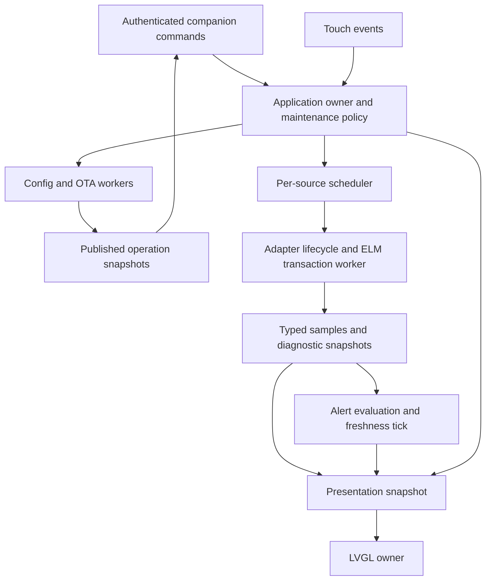

# Firmware core review and execution plan

Date: 2026-09-26. Reviewed revision: `04ee7eab1d046b84c740ef2f1bfa3d2e2b8d2d2c`, branch `feat/owned-gauge-control`.

Status: software execution complete on 2026-09-26. Target hardware and real-adapter evidence remains tracked separately.

## Execution outcome

| Package | Implemented outcome | Evidence boundary |
| --- | --- | --- |
| FW-01 | ECM reconnects with bounded 500 ms to 8 second backoff and clears stale UI/diagnostic state. ELM bytes remain connection-generation tagged. | Firmware builds and host fixtures pass. Live adapter loss/recovery still requires an adapter. |
| FW-02 | Config and OTA publish callback-safe immutable status, use fixed activation deadlines, reject terminal aborts, retain the transfer gate through restart, and treat exact command retries as idempotent. | Source/build verified. Slow-flash callback timing and power interruption require the gauge. |
| FW-03 | GATT readiness checks characteristic properties, discovers the CCCD, confirms subscription, and completes a bounded ELM initialization profile. | Compiles against ESP-IDF 5.4.1. Actual adapter profiles remain unobserved. |
| FW-04 | Touch and phone changes enter one application owner; UI samples include PID identity; alert/companion expiry run at 100 ms; diagnostics use one snapshot; the pure scheduler budgets one background job per ten normal jobs. | Sanitizer fixtures cover scheduler, alert, decoder, stale state, priority, and timer wrap. |
| FW-05 | A nonrecursive JSON guard enforces depth 16 and matching delimiters; runtime rejects unsupported PID 01; storage exposes record readers; configuration commits use a persistent trial journal with reset-before-confirmation fallback; runtime identity version 8 reports the generation actually in use and trial state; OTA health requires sustained task progress. | Host sanitizer fixtures cover the config-trial policy. Firmware build, protocol documentation, and Android client compile pass. Destructive power-cut testing remains a hardware gate. |
| FW-06 | UI updates only dirty numeric state, selects fonts by measured width, keeps badges inside the circular viewport, rejects late PID samples, moves touch persistence out of LVGL, and handles partial queue allocation failure. Low-frequency health counters expose stack, heaps, queue space, and drops. | Source/build verified. Frame timing and circular display review require the gauge. |
| FW-07 | Version comes from `version.txt`, ESP-IDF is constrained to 5.4.x, broad warning suppression is removed, CI runs the real firmware build and sanitizer fixtures, and runtime ownership/protocol/evidence documents are reconciled. | Clean local firmware and Android builds pass. CI must confirm the pushed revision. |
| FW-08 | Available deterministic and build gates pass and remaining physical gates are enumerated in the validation record. | Live OBD, dual-adapter, physical power interruption, and soak results are intentionally unclaimed. |

Implementation and current limits are documented in [firmware runtime ownership](../architecture/firmware-runtime.md) and [firmware core hardening validation](firmware-core-hardening-validation.md).

## Recommendation

Harden recovery, concurrency, and activation semantics before expanding the feature set or tuning clocks and buffers. Preserve the working phone association and experimental protocol while replacing implicit shared state with explicit owners, bounded commands, and consistent snapshots. Use incremental changes with regression evidence, rather than a complete rewrite.

The most urgent source findings are:

1. ECM polling does not reconnect after an established link disconnects.
2. BLE status callbacks can block behind flash erase, hashing, and JSON validation.
3. Status requests can indefinitely defer configuration and OTA restart; configuration abort is accepted even after commit.
4. Diagnostic transactions block the same task responsible for normal polling, alert freshness, and pairing-display expiry.
5. Touch and phone commands mutate shared application state independently, and queued values lack the identity needed to prevent an old reading appearing under a new page label.

Start with **FW-01: reproducible baseline and ECM recovery**. Finish FW-01 through FW-04 before adding discovery, more renderers, or a second polling adapter.

## Scope and evidence

Reviewed application startup, FreeRTOS task interactions, central/peripheral BLE, ELM framing and transactions, decoding, scheduling, alerts, diagnostics, configuration validation/storage/transfer, OTA, LVGL presentation, board support, build settings, CI, and architecture documentation.

Current PR #3 checks at the reviewed SHA report successful contracts/docs, firmware build, and Android jobs. The workflow runs sanitizer fixtures for `elm_response.c`; it does not execute the firmware configuration, transfer, scheduler, or alert implementation. The Python contract validator is a separate implementation and is not a substitute for exercising the C code.

Prior physical evidence is recorded in [current state](../current-state.md), [configuration validation](numeric-config-transfer-validation.md), and [OTA recovery validation](update-recovery-validation.md). Those are historical observations, not fresh hardware checks from this review. OBD adapter compatibility, live ECM/TCM polling, and three-link coexistence remain unverified.

Source locations below refer to the reviewed revision. Findings marked **confirmed** follow directly from code. A **risk** requires a targeted reproduction or measurement before assigning a measured impact. Proposed budgets are acceptance targets, not current performance results.

## Foundations to retain

- Owner authorization checks encrypted, authenticated, bonded identity for protected commands and reads: [ble_companion.c](../../firmware/gauge/main/src/ble_companion.c), lines 81-87 and 129-150.
- ELM responses have fixed bounds, prompt framing, generation-tagged RX bytes, and rejection of ambiguous responses: [ble_obd.c](../../firmware/gauge/main/src/ble_obd.c), lines 79-109 and 189-237; [elm_response.c](../../firmware/gauge/main/src/elm_response.c).
- Configuration writes use an inactive slot, hash, header CRC, final commit marker, and readback: [config_store.c](../../firmware/gauge/main/src/config_store.c), lines 237-286.
- Schema validation rejects unknown/duplicate fields and validates references, numeric bounds, and decoder examples: [config_document.c](../../firmware/gauge/main/src/config_document.c).
- OTA checks the payload hash and development signature before selecting a boot slot: [ota_transfer.c](../../firmware/gauge/main/src/ota_transfer.c), lines 75-117 and 197-204.
- UI data is mostly delivered through bounded mailboxes, and stale numeric readings disappear: [ui.c](../../firmware/gauge/main/src/ui.c), lines 243-262 and 400-445.
- Public capability flags distinguish the experimental subset from full configuration and OTA support. Keep that distinction throughout this work.

## Findings and required changes

### F01. Established ECM links never re-enter connection setup

**P1, confirmed.** [main.c](../../firmware/gauge/main/main.c), lines 246-263, connects until the first success. The subsequent loop, lines 287-293, only clears readings and continues when disconnected. The manager disconnect callback clears state but does not schedule a reconnect ([ble_mgr.c](../../firmware/gauge/main/src/ble_mgr.c), lines 307-314). Consequently, adapter loss or the transport's intentional timeout/overflow disconnect leaves ECM sampling stopped until a reboot. TCM has a separate reconnect loop, so the two paths also behave differently.

**Change:** an explicit per-source lifecycle with bounded retry/backoff. Initially fix ECM reconnection in place, then unify both sources behind the same state machine. Invalidate samples on disconnect and prevent old discovery completions or bytes from entering a new session.

**Acceptance:** initial absence, disconnect after successful polling, prompt timeout, overflow, stack reset, and adapter reappearance all recover without reboot or phone intervention. Delayed events from a prior connection cannot mark a new session ready.

### F02. Transfer workers still block the shared BLE host indirectly

**P1, confirmed blocking path; duration unmeasured.** [config_transfer.c](../../firmware/gauge/main/src/config_transfer.c), lines 84-160, holds its session mutex through store operations. [config_store.c](../../firmware/gauge/main/src/config_store.c), lines 150-164 and 237-286, holds the store mutex through erase, hash, validation, and commit. [ota_transfer.c](../../firmware/gauge/main/src/ota_transfer.c), lines 124-210, similarly holds its mutex through `esp_ota_begin`, writes, and full-image verification. GATT state reads call status/store APIs that take these locks with `portMAX_DELAY` ([ble_companion.c](../../firmware/gauge/main/src/ble_companion.c), lines 197-267).

Putting flash work in a worker task does not prevent a status read from waiting for that work in the NimBLE callback. Both adapter links and the phone share that host.

**Change:** workers own operation state and publish small immutable status snapshots. GATT callbacks only validate, copy, enqueue, or copy a published snapshot. Prefetch document chunks outside the host callback with explicit pending/busy behavior compatible with Android. Remove unbounded lock waits and flash/NVS work from application GATT paths, including legacy saved-state reads. Review owner persistence in GAP callbacks separately without weakening fail-closed authorization.

**Acceptance:** injected slow flash and validation do not make application BLE callbacks wait for those operations. Status remains responsive and reports pending/completed/error accurately. This does not promise zero system-wide flash/cache latency; measure that separately on the board.

### F03. Activation is controlled by last activity rather than a fixed deadline

**P1, confirmed.** Config and OTA status commands refresh `last_activity`, and restart occurs only after five seconds of inactivity: [config_transfer.c](../../firmware/gauge/main/src/config_transfer.c), lines 85-89 and 178-181; [ota_transfer.c](../../firmware/gauge/main/src/ota_transfer.c), lines 125-129 and 226-229. Continued polling can postpone restart indefinitely. Config abort accepts an applied session at lines 151-155, cancelling restart after the store already changed its active record. Both transfers release the mutual-exclusion gate before reboot, allowing another operation to start while activation is pending.

**Change:** terminal activation state with immutable `activation_deadline`, distinct from inactivity expiry. Hold the maintenance lease through reboot. Reject abort after durable commit, or define an explicit separately implemented rollback operation. Record stored revision and running revision separately. Define retry behavior for every opcode, including commit, verify, metadata parts, and lost responses.

**Acceptance:** repeated status reads and invalid writes cannot delay activation; post-commit abort cannot leave the device indefinitely running old configuration while reporting new configuration as applied; no new transfer starts during pending restart. Retry reports the original outcome or a precise conflict without repeating side effects.

### F04. Diagnostics and transport waits control alert and polling cadence

**P1, confirmed.** [main.c](../../firmware/gauge/main/main.c), lines 274-342, runs a MIL request with a 700 ms timeout plus three diagnostic requests with 1,500 ms timeouts before a normal PID. These configured waits total 5.2 seconds before normal polling, and draining a previous prompt can add further delay. `alert_engine_tick` and `ble_companion_tick` share this loop. Initial adapter connection attempts can also block these ticks for seconds. `vTaskDelayUntil` does not restore a bounded service interval after blocking work.

**Change:** a scheduler with at most one outstanding ELM transaction per adapter, absolute transaction deadlines, visible/alert PID priorities, and a bounded background diagnostic budget. Run alert freshness and companion expiry from a short independent application tick. Request selection must use current time after completed work, skip missed periods instead of creating catch-up bursts, and report unattainable requested rates.

**Acceptance:** silent or slow diagnostics do not delay local alert freshness evaluation or pairing-display expiry. A diagnostic command already in flight has an explicit maximum blocking budget; no promise of preempting an ELM command. Fair scheduling preserves service for hidden-page alert inputs and prevents background starvation.

### F05. Shared selection state and untagged UI samples permit mismatches

**P1, confirmed unsynchronized access; visible race not reproduced.** Touch handling modifies `g_config` and `g_current_obd_cfg` inside the LVGL timer callback ([main.c](../../firmware/gauge/main/main.c), lines 374-389; [ui.c](../../firmware/gauge/main/src/ui.c), lines 264-271). Phone commands modify them from `app_main`, lines 527-551. The NVS mutex protects individual storage calls, not the application read/modify/write sequence; rotation's revision check and save are also separate calls.

The displayed PID is atomic, but `ui_sample_t` contains only value/time. A response can pass the old PID check at main.c:234, then enqueue after a page switch clears the value. The UI cannot reject that old sample under the new label. No actual mismatch is claimed from hardware.

**Change:** one application owner serializes touch and phone commands. Samples carry source, definition ID/index, connection generation, configuration generation, time, and quality. UI consumes a consistent selected-page snapshot and only matching samples. Keep revision comparison and mutation atomic at the storage/application boundary.

**Acceptance:** forced interleavings of page changes, samples, rotations, and phone commands cannot lose unrelated settings or display data for the wrong PID. Touch feedback does not wait for flash.

### F06. Diagnostics freshness and alert edge semantics need consolidation

**P2, confirmed.** Gauge diagnostic state is duplicated between main globals and `diagnostics_state.c`. `show_diagnostics` computes age only when invoked after selected responses or disconnects ([main.c](../../firmware/gauge/main/main.c), lines 92-122, 195-203, 307-315). The UI diagnostic mailbox has no timestamp or expiry ([ui.c](../../firmware/gauge/main/src/ui.c), lines 61-66 and 228-241). A connected adapter that stops answering can leave a stale CEL/DTC badge visible as current, while the protected snapshot has age flags. The first stored DTC also has no independent freshness in the gauge globals.

In [alert_engine.c](../../firmware/gauge/main/src/alert_engine.c), lines 49-67, zero trigger or clear dwell still requires a second qualifying sample. A numeric reading outside `int32_t` is discarded before alert evaluation in main.c:217-228, although the configuration range contract allows wider values.

**Change:** one source-aware telemetry/diagnostic store; derive UI and companion status from it. Keep exact decoded values for alert evaluation independently of display formatting. Specify zero-dwell, missing-data, latching, priority ties, and reconnect behavior. Preserve an active warning when data disappears but identify the loss clearly.

**Acceptance:** fake-clock coverage for immediate and delayed thresholds, gaps, hysteresis, escalation, wraparound, and stale diagnostics; both phone and gauge agree on validity. Ordinary samples cannot silently bypass alerts because of a rendering type restriction.

### F07. GATT connection success is weaker than adapter readiness

**P1 for adapter readiness, confirmed.** [ble_mgr.c](../../firmware/gauge/main/src/ble_mgr.c), lines 415-423, marks a link connected when characteristic handles exist. Lines 458-467 assume CCCD at value handle + 1, ignore subscription completion, and only log submission errors. No characteristic-property checks establish the write/notification behavior. [ble_obd.c](../../firmware/gauge/main/src/ble_obd.c), lines 141-186, returns that link without an ELM initialization/format negotiation sequence.

The parser intentionally accepts only headerless, single-responder replies. The runtime requires a configured `responseId` of `7E8` but cannot verify that responder from headerless bytes. Treat ECU identity as unverified under this transport, not as measured attribution.

**Change:** discover descriptors and validate characteristic properties; await confirmed subscription before readiness. Add bounded adapter-profile initialization and explicit accepted response format. Model `connected`, `subscribed`, `adapter ready`, and `vehicle responding` separately. Preserve rejection of ambiguous replies. Restrict auto-selection and add durable source binding before broad dual-adapter support.

**Acceptance:** mock GATT layouts with nonadjacent CCCDs, write/notify errors, and delayed callbacks remain unready or recover cleanly. Adapter-profile replay covers initialization success/failure and late prompts. Real profile compatibility remains gated on actual adapter evidence.

### F08. Configuration parsing has byte bounds but an excessive recursion allowance

**P1 hardening risk, not a reproduced crash.** [config_document.c](../../firmware/gauge/main/src/config_document.c), lines 395-415, parses before checking the schema shape. The local pinned IDF cJSON source defaults `CJSON_NESTING_LIMIT` to 1000; the local compilation database shows no override. Transfer workers have 6,144-byte stacks and the main task has 3,584 bytes. A 64 KiB input bound does not provide a suitable recursion/stack budget for those tasks. Schema rejection occurs after parsing.

**Change:** enforce a schema-appropriate depth limit before recursive parsing, or configure the actual cJSON component with a reviewed bounded depth. Add node/allocation budgets and error distinction for invalid documents versus resource exhaustion. Keep global allocator hook initialization before concurrent use. Do not increase task stacks as the sole fix.

**Acceptance:** deeply nested, broad, escaped-string, duplicate-field, truncated, and maximum-size inputs fail with bounded time/memory without stack overflow. Run the actual C validator/compiler under host sanitizers and record target stack/PSRAM watermarks.

### F09. Durable configuration, running configuration, and boot health differ

**P1 recovery gap, confirmed.** Store initialization selects the newest schema-valid slot ([config_store.c](../../firmware/gauge/main/src/config_store.c), lines 72-118). Runtime load separately recompiles it and falls back to built-ins on failure ([main.c](../../firmware/gauge/main/main.c), lines 414-421), while the store still reports that document active. It does not try a previous executable generation. [config_runtime.c](../../firmware/gauge/main/src/config_runtime.c), lines 148-171, duplicates private flash offsets to locate the slot and ignores the four partition-read return codes.

OTA trial confirmation in main.c:157-171 relies on `ble_companion_ready`, which means advertising started. It does not establish sustained UI/control-task progress or successful activation of the saved document. Rollback must work without a phone or adapter, but an advertising flag alone is too weak a health criterion.

**Change:** store-owned immutable document handles/read APIs; explicit stored/running/trial/confirmed revision and recovery reason. Define compatible fallback and configuration trial confirmation across OTA rollback before modifying persistent formats. Add boot supervision based on successful essential initialization plus task progress over a bounded interval. Provide a recoverable diagnostic state for allocation/storage failure instead of silently claiming normal activation.

**Acceptance:** new firmware with incompatible config, corrupt newest slot, runtime allocation failure, initialization failure, and trial reset recover predictably with an honest reported revision. Preserve owner bonds, previous executable config, and an OTA rollback-compatible storage format.

### F10. Runtime acceptance and executed behavior need a single contract

**P2, confirmed.** Runtime compilation accepts Mode 01 PID `01`, but the response callback reserves it for diagnostics and returns before the configured decoder/page/alert path ([config_runtime.c](../../firmware/gauge/main/src/config_runtime.c), lines 65-101; main.c:195-205). Runtime page limit is five while the runtime header reserves eight and schema allows eight. Numeric ranges and text permitted by the schema exceed some display capabilities. Schema vector decoding and runtime decoding also have separate implementations.

**Change:** a runtime capability descriptor supplies limits to compiler, companion, documentation, and fixtures. Explicitly reject unsupported/reserved definitions or route one response to both diagnostics and configured consumers. Share the pure decoder where feasible. Distinguish schema-valid, executable, stored, and running outcomes.

**Acceptance:** every accepted configuration executes its declared supported behavior; intentional subset restrictions return a precise reason before commit. Cross-language vectors cover signedness, endian, scale, limits, and reserved PID handling.

### F11. UI and RX paths have avoidable work, but tuning needs measurements

**P2, confirmed work; speedup unmeasured.** UI rewrites numeric text, font style, widths, and alignment every 50 ms, including the unchanged unavailable state ([ui.c](../../firmware/gauge/main/src/ui.c), lines 168-196 and 243-262). Touch saves NVS synchronously under the LVGL callback. Five UI queue allocations are not individually checked at lines 376-380. RX enqueues one generation-tagged struct per byte, up to 512 entries per source ([ble_obd.c](../../firmware/gauge/main/src/ble_obd.c), lines 50-53, 79-90, 157). Every decoded reading is logged at INFO in main.c:233.

**Change:** dirty-field rendering, layout only on structural changes, bounded asynchronous persistence, explicit allocation cleanup, and rate-limited diagnostics. Benchmark chunk queues or a bounded ring against byte queues while retaining generation and overflow guarantees. Keep fixed-size hot-path storage where it improves predictability. Benchmark existing 10-row LCD buffer before changing DMA buffers, affinity, PSRAM placement, SPI speed, or optimization level.

**Acceptance:** no redundant label/layout updates once the display settles; one input event per tap; no persistent save per sample; allocation failures enter a defined recovery path. Record CPU, callback time, heap, queues, and render time before/after each optimization.

### F12. Build provenance and documentation need reconciliation

**P2, confirmed.** [quality.yml](../../.github/workflows/quality.yml), line 41, hardcodes `PROJECT_VER=0.1.0-baseline` while [version.txt](../../firmware/gauge/version.txt) says `0.2.0-dev.2`. The component declares IDF `>=4.1.0` despite using a pinned 5.4.1 environment and APIs. Global warning suppression and main-component warning enforcement coexist. The current local compile command ends with `-Wshadow -Werror` for application code, so application warnings are not simply all disabled; make the intended policy explicit and limit exceptions to their dependencies.

[Quality strategy](quality.md) says there is no Android build, while CI builds Android. [Roadmap](../roadmap.md), [system architecture](../architecture/system.md), [transport status](m1-transport-status.md), and [hardware strategy](../architecture/hardware-and-transports.md) mix obsolete baseline descriptions with current behavior. Configuration trial rollback and request idempotency appear as design requirements without implementation evidence.

**Change:** a single build-version source, explicit supported toolchain, reproducible dependency/container records, development/release configuration profiles, and separate current implementation versus planned contract sections. Document task owners, blocking rules, state transitions, capacities, failure recovery, and public API preconditions near the code.

**Acceptance:** clean builds report the intended version and source identity; generated protocol/runtime limits agree; documentation links requirements to implementation and evidence, with no planned feature described as observed.

## Target ownership model

This implements the boundaries already proposed in [system architecture](../architecture/system.md). Module boundaries do not imply one RTOS task per module.

| Owner | Responsibility | Boundary |
| --- | --- | --- |
| NimBLE host | GAP/GATT events, bounded validation, queue admission, snapshot reads | No application flash work, LVGL calls, or waits on long operations |
| Application owner | Selection/rotation commands, runtime generation, maintenance transitions | Serial command processing; bounded tick; delegates persistence |
| Adapter worker, one per enabled source | Connection lifecycle, ELM initialization, one transaction, deadline and prompt resync | Session epoch identifies every event; no direct UI mutation |
| Scheduler | Due requests, deadlines, priorities, backoff and diagnostic budget | Operates on observed capacity; never assumes requested rate is achieved |
| Telemetry/diagnostics | Source and ECU identity, value, quality, timestamp, generation | Fixed bounded snapshots; unknown identity remains unknown |
| Alert engine | Threshold/dwell/hysteresis and data-loss behavior | Uses decoded samples; clock tick independent of transport waits |
| Config/OTA workers | Bounded transaction processing and persistence | Short snapshot publication; one maintenance lease; explicit terminal states |
| LVGL task | Objects, layout, rendering, touch detection | No flash saves; consumes snapshots; emits commands |
| Health supervisor | Essential initialization and task-progress evidence | Does not require phone/vehicle presence to confirm a healthy boot |

Locking rule: document a lock order, avoid nested subsystem locks, and publish snapshots only after worker state changes. Prefer a single writer plus short copy protection over widespread atomics for related fields. Use typed enums and centralized wire constants instead of raw operation/phase numbers. Report queue saturation explicitly for commands; only superseded presentation snapshots may be overwritten.

## Ordered execution backlog

Each row is a reviewable change or small series of changes. Keep mechanical extraction separate from behavioral fixes where possible. Add focused regression coverage with each fix, then broaden the harness as boundaries become pure C. Complexity describes relative effort, not a delivery promise.

| Order | Work package | Changes and dependencies | Exit evidence | Complexity |
| --- | --- | --- | --- | --- |
| 1 | **FW-01: baseline and immediate recovery** | Capture exact version/config/map/task inventory and existing protocol fixtures. Introduce fake clock/link seam sufficient to reproduce F01, then fix ECM reconnect without reorganizing all modules. Add bounded reconnect metrics. | Failure-before/fix-after recovery cases; no stale sample accepted across reconnect; baseline builds and compatibility fixtures. | Medium |
| 2 | **FW-02: bounded transfer/control callbacks** | F02/F03. Publish operation snapshots, remove callback dependency on long worker/store locks, fixed activation deadlines, terminal states and lease ownership. Define retry matrix and preserve wire compatibility. Depends on FW-01 baseline. | Slow-flash status reads, queue saturation, lost responses, repeated status/commit, post-commit abort and config/OTA overlap fixtures; paired phone regression later. | High |
| 3 | **FW-03: adapter session and readiness** | F07 and remaining F01 lifecycle work. Extract lifecycle from BLE manager, descriptor/property discovery, subscription completion, profile initialization, session-tagged asynchronous results and bounded retries. | Mock GATT/ELM sessions, adversarial callback ordering, timeout/resync cases; actual adapter compatibility remains open. | High |
| 4 | **FW-04: application state, scheduler and samples** | F04/F05/F06/F10. Serialize touch/phone commands; introduce telemetry identities/snapshots; fake-clock scheduler; separate alert/expiry tick; diagnostic budgets and sample quality. Use FW-03 readiness states. | No wrong-page values; atomic revision conflicts; fair polling under slow diagnostics; stale/CEL and alert semantics covered; unsupported runtime configs rejected. | High |
| 5 | **FW-05: bounded configuration and boot recovery** | F08/F09. Parser resource limits, store-owned reader, structured validation reasons, runtime capability checks, stored/running identity, config fallback/trial policy and OTA health supervision. Requires explicit storage compatibility ADR. | Actual C parser/compiler fixtures; mocked power cuts at every write/marker step; old/new firmware compatibility matrix; unhealthy trial fails confirmation; known-good generation retained. | High |
| 6 | **FW-06: measured UI/memory efficiency** | F11. Dirty rendering, display formatting, circular geometry, asynchronous/coalesced selection persistence, resource cleanup. Benchmark RX batching, logging and LCD buffer options against baseline. Depends on FW-04 ownership. | Before/after metrics; unchanged screen produces no repeated application label/layout updates; all rotations/long text fit; no hot-path allocation growth. | Medium |
| 7 | **FW-07: maintainable build and documentation** | Complete F12. Split stable modules into appropriate IDF components, standardize errors and public API contracts, pin supported build identity, reconcile architecture/roadmap/evidence. Documentation also ships with each earlier package. | Clean reproducible debug/release builds, explicit warning policy, module dependency diagram, protocol/state tables, recovery runbooks, linked evidence. | Medium |
| 8 | **FW-08: integrated reliability qualification** | Combine fault injection, soak and available hardware checks. Feed findings into earlier packages; do not promote capabilities from compilation alone. | Recorded gates below, unresolved risks and adapter matrix; beta decision based on evidence. | High, hardware dependent |

### First implementation change: FW-01, completed in source

- [x] Freeze the reviewed source/protocol/storage baseline and record CI/build identity.
- [x] Add a minimal pure clock/scheduler boundary while retaining the generation-tagged link boundary.
- [x] Preserve deliberate timeout/overflow disconnect behavior and re-enter connection setup after link loss.
- [x] Re-enter bounded connection setup, clear old telemetry, and preserve phone/owner independence.
- [x] Record reconnect attempts and health counters at low frequency without per-byte logs.
- [x] Build firmware, run focused host fixtures, and document precisely which checks still require adapters.

The deterministic lifecycle behavior is implemented. A live adapter remains required to claim field recovery works on actual adapter firmware.

## Measurement and acceptance gates

Collect counters and histograms at low frequency. Never log passkeys, bond secrets, signing material, or unredacted vehicle identity. Record the source SHA, IDF version, build profile, board, workload, document size, and artifact hash with every result.

| Area | Proposed gate or measurement |
| --- | --- |
| BLE callbacks | No application unbounded waits or flash/JSON work. Initial target: application callback p99 below 5 ms, with maximum and flash-operation correlation recorded. Revise target only from measured evidence. |
| Touch/presentation | Initial target: input to visible feedback p95 below 100 ms during polling and config transfer. Measure separately during unavoidable flash/cache stalls. |
| Freshness/alerts | Independent evaluation tick at most 100 ms late in the stress fixture. Stale indication within configured expiry plus one presentation interval. Dwell follows sample times; no fabricated intermediate values used by alerts. |
| Scheduler | Report achieved interval and lateness per definition, response percentiles, timeout rate, queue delay and diagnostic utilization. No fixed vehicle request-rate promise until adapter measurements exist. |
| Memory | Internal/DMA heap and PSRAM free, minimum free and largest block; per-task stack watermark; queue high-water and overflow counts. Define stack margin from worst observed path, with an initial minimum 25% headroom target. |
| Rendering | LVGL callback/frame duration, changed regions/flush bytes, idle work, buffer memory and UI queue drops. Compare existing 10-row buffer with measured alternatives individually. |
| Storage | NVS writes per user session; erase/write/verify latency; parser peak memory; complete operation time. Debounce page persistence only with an explicit last-page durability contract. |
| OTA | Transfer throughput, callback latency during erase/verify, trial confirmation time, interruption/retry outcome and surviving configuration identity. |
| Reliability | First: two-hour combined controlled bench soak and 100 disconnect/reconnect cycles. Before production: 24-hour soak and physical power-interruption matrix. No monotonic memory loss, watchdog reset, false fresh reading, or false activation success. |

A rate or memory optimization only qualifies as an improvement if recovery, attribution, authorization, and tail latency remain correct. Do not remove integrity rechecks solely to reduce parse/hash work. First measure repeated validation, then cache only against immutable staged bytes and retain the checks that establish durability.

## Validation matrix and hardware dependencies

### Can proceed without phone or OBD adapters

- Pure C parser, numeric decoder, schema/runtime, alerts and scheduler fixtures with fake time and sanitizers.
- Mock GATT events, nonadjacent CCCDs, property/subscription failures, lost writes, stale callback generations and RX overflow.
- Mock partition/NVS failures, interrupted erase/header/marker writes, duplicate/out-of-order commands, stale base revision, and terminal activation state.
- Cross-language wire/decoder golden vectors; maximum-size documents, malformed/deep JSON and deterministic allocation failure.
- Recorded ELM replay and a BLE fixture peer if suitable bench hardware is available. Mark all such traffic synthetic.
- Build provenance, documentation, module extraction and static analysis. Measure target performance only when the gauge is available.

### Requires the gauge, but not vehicle adapters

- Startup/resource-failure behavior, LVGL/touch at 0/90/180/270 degrees, long names, negative/large values, pairing code and critical/data-lost messages.
- Essential content must fit the actual circular viewport, including the corners of top and bottom badges. Font selection must use measured pixel width and available glyphs rather than character count alone.
- Flash/JSON latency, heap/stack/queue measurements, config activation and OTA trial supervision using a controlled fixture.
- Physical power-interruption testing with known recovery image and non-destructive preservation of bond/config partitions.

### Requires the phone

- Regression of existing owner bond, protected reads/writes, complete config readback, transfer retry, status polling through activation, import/reconciliation and honest failure display.
- Enable the existing Android debug-awake workflow for the session and restore it afterward, as required by `AGENTS.md`.

### Requires real OBD adapters and later vehicle evidence

- Capture each adapter's exact GATT map and initialization behavior before declaring support.
- Single adapter: real request/response timing, adapter loss/recovery, no-data versus timeout, negotiated response format and known ECU attribution limits.
- Dual adapter: ECM + TCM + phone coexistence, per-source freshness, reconnect isolation, queue/memory pressure and throughput. Keep the measured fallback decision open if simultaneous links cannot meet requirements.
- Scope DTC clearing separately: explicit user action, preconditions, ambiguous completion and no automatic retry. Do not include live code clearing in an automated refactor regression run.

## Compatibility and scope guardrails

- Preserve existing owner identities, NimBLE bonds, NVS offsets, partition layout and valid config generations throughout the initial refactor.
- Preserve current opcodes, status layouts, hashes and legacy behavior until a separately documented negotiated protocol change is necessary. Golden fixtures must cover the installed Android client.
- Any persistent trial/rollback metadata change needs a reader/writer compatibility matrix for both OTA slots and an interruption-safe migration design before implementation.
- Keep public full-configuration, OTA and simultaneous-adapter claims gated by their documented evidence. Tests with synthetic traffic do not establish vehicle compatibility.
- Retain strict bounds and explicit unsupported results. Do not silently accept Mode 22, alternate renderers, units, source routing, or user expressions that cannot execute.
- Plan Wi-Fi as another transport into the same operation service after these boundaries are stable. Do not build a separate updater. Radio coexistence, provisioning and throughput remain separate measured work.
- IMU, battery sensing, sleep policy, brightness PWM, manufacturer PID discovery, production key rotation/downgrade policy, secure boot and flash encryption remain follow-on features or provisioning decisions. Do not burn eFuses or change the toolchain during this refactor.

## Documentation deliverables and completion rule

Maintain these with the implementation, not as a final cleanup:

1. Current task/priority/stack/queue inventory and ownership/lock map.
2. Adapter lifecycle, transaction, configuration and OTA transition tables, including every failure/timeout/duplicate path.
3. Wire protocol and runtime capability matrix with implemented, experimental, unsupported and observed states.
4. Memory/timing budgets and reproducible benchmark workloads.
5. Storage-format and firmware/config compatibility ADR; USB and OTA recovery runbooks.
6. Header-level API contracts: caller task, pointer lifetime, ownership, blocking bound, errors and retry rules.
7. Updated current-state/roadmap documents, per-change validation notes and adapter compatibility records.

Each work package is complete when its focused tests and relevant builds pass, evidence and limitations are recorded, public claims remain accurate, and the previous working image/config can still be recovered. The core review is complete; execution starts with FW-01.
