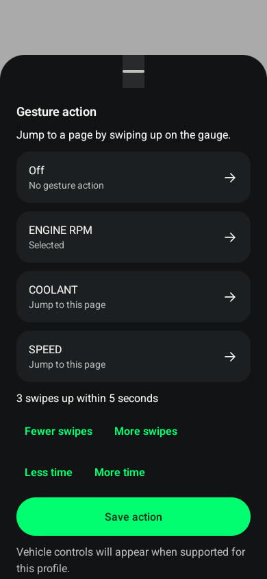

# Profile action fixture evidence

> Historical evidence. Versions, measurements and unfinished steps below describe that session.
> Current support is in [current state](../current-state.md); remaining work is in
> [the backlog](../backlog.md). These notes are not standing implementation instructions.

## Software verification, 2026-10-07

- 89 Android unit tests passed, including profile migration, action projection,
  exact readback, capability gating, invalid commands/parameters and child routing.
- Three isolated native Compose tests passed on the existing Television AVD with
  a forced 390 × 844 portrait viewport: save defaults/edits, older-firmware draft
  behavior and busy-state rejection. This is emulator evidence, not a Pixel test.
- 73 offline host tests passed; production config compiler/validator and pure
  gesture fixtures passed with AddressSanitizer/UndefinedBehaviorSanitizer.
- Debug APK/test APK, Android lint, ESP-IDF 5.4.1 build and contract/link checks passed.
- Emulator wake/display overrides were restored and the emulator was stopped.
  No physical device installation, BLE session or vehicle command occurred.

Native example of the action sheet with simulated profile data:

Physical gauge gesture recognition, touch/pairing regression, orientation, automatic
page cycling and restart persistence still need owner observations after an explicitly
qualified App/Wi-Fi candidate installation. Idle/ABS procedures still lack matching
controller identity, complete sequences, response semantics and restoration evidence.

The four Car goldens (compact/expanded, light/dark) were refreshed for the Actions
row and passed strict comparison on the API-36 emulator. GoldenScreenshotTest now
supports `fixtureName=car` for focused maintenance and waits up to five seconds for
foreground accessibility state before capture, avoiding a startup-focus race.
An unchanged Settings control comparison passed expanded references but differed
by 270/271 pixels around arrow glyphs in the compact references. Those original
Settings references and the existing tolerance were retained. This is a renderer
comparison limit, not a claim that the full Pixel golden suite passed; repeat that
suite on the Pixel before physical UI qualification.
